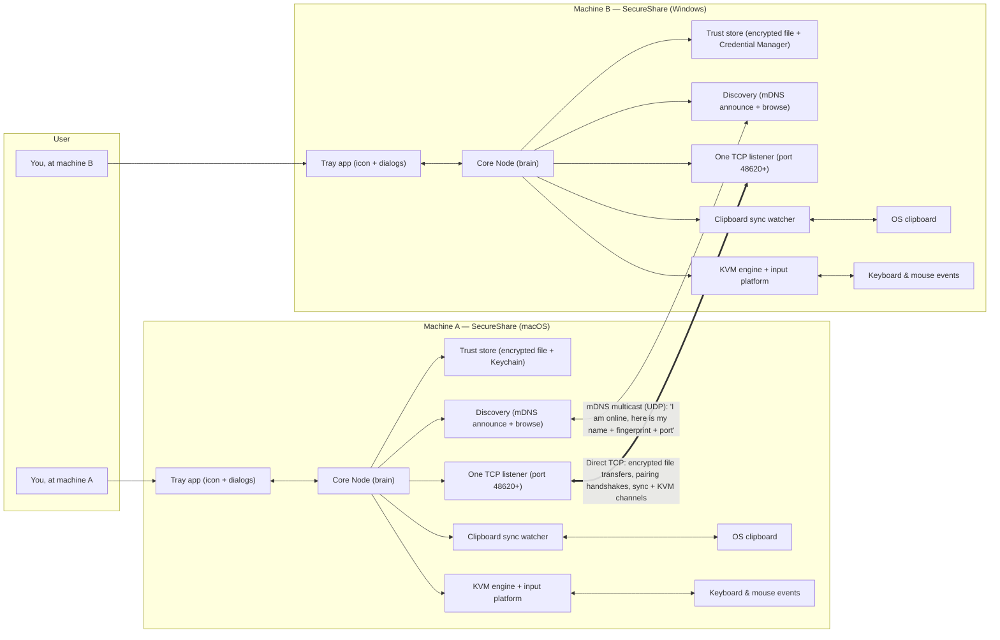

# 2. High-Level System Architecture

## The system at a glance

Two (or more) copies of the same application run on the user's own
machines on the same LAN. Each copy is a complete, self-contained
peer — there is no server/client split, no cloud, and no central
authority. Every machine runs all roles: it discovers, it pairs, it
sends, it receives, it syncs, and it can share its input.

### How to read this diagram

Start at machine A's tray icon. The user clicks it and picks an action
(pair, send a file, toggle sync, toggle KVM). That request goes into the
Core Node, the central piece that owns everything.

The Node has three ways of reaching machine B:

1. **Discovery** first tells the Node *that* B exists and *where* it is
   (IP address + port) using multicast DNS — no server required. This is
   the only UDP traffic; everything else is TCP.
2. **The TCP listener** is the single door on each machine through which
   *all* incoming connections arrive — file transfers, pairing requests,
   sync channels, and KVM channels are distinguished by the first message
   on the connection.
3. **The trust store** decides *who is allowed in*: it holds the
   cryptographic keys that were established during pairing, and every
   protocol uses those keys to authenticate and encrypt.

On top of the Node sit two optional background activities, both driven by
the OS:

- **Clipboard sync** watches the OS clipboard and mirrors changes to
  paired peers.
- **KVM** captures the OS keyboard/mouse stream and injects events
  received from the peer.

Nothing in the diagram exists outside the user's own machines. The only
"external services" are OS facilities (keychain, clipboard, input
subsystem) and mDNS itself — see [09-external-dependencies.md](09-external-dependencies.md).

---

## Component map

| Component | Responsibility | Where it lives |
|---|---|---|
| Tray application | Menu-bar/tray icon, dialogs (pairing PIN, send picker, transfer progress), notifications. Pure UI; delegates everything to the Node | `tray/app.py`, `tray/logbook.py` |
| Node | Composition root: owns and wires every core subsystem; defines the app's lifecycle | `core/node.py` |
| Crypto primitives | ECDH key agreement, HKDF key derivation, AES-GCM encryption, PIN derivation | `core/crypto.py` |
| Pairing manager | Runs the first-meeting handshake and PIN confirmation | `core/pairing.py` |
| Trust store | Persistent record of this device's identity + paired peers + trust keys; encrypted at rest | `core/trust_store.py` |
| Transfer server | TCP listener; accepts all connection types; streams files in/out; enforces admission rules | `core/transfer.py` |
| Discovery | mDNS advertise + browse + async resolution; maintains the "who is online" registry | `core/discovery.py` |
| Sync engine | Persistent encrypted clipboard channels; polls the clipboard; mirrors text/images | `core/sync.py` |
| Clipboard abstraction | Cross-platform read/write of text + images + file-copy detection | `core/clipboard.py`, `core/clipboard_mac.py`, `core/clipboard_win.py` |
| KVM engine | Link + control state machines, handoff protocol, event routing, watchdog | `core/kvm.py` |
| KVM event codec | Compact binary encoding of mouse/key/control events | `core/kvm_events.py` |
| KVM geometry | Screen-seam math: jump zones, entry/return points, proportional mapping | `core/kvm_geometry.py` |
| KVM keymap | HID ↔ macOS virtual keycode ↔ Windows scan-code tables | `core/kvm_keymap.py` |
| KVM platform (macOS) | CGEventTap capture, suppression, injection, cursor association, Secure Input health | `core/kvm_platform_mac.py` |
| KVM platform (Windows) | Low-level hooks capture, suppression, SendInput injection, warp bookkeeping | `core/kvm_platform_win.py` |
| Admission limits | Per-IP connection caps, token-bucket rate limiting, trusted-subnet filtering | `core/limits.py` |
| Version | Version label shown in the tray menu | `core/version.py` |

## How the components communicate (in-process)

All core components run in one Python process. They communicate by direct
method calls and by shared state:

- The **tray app** and the **Node** are deliberately decoupled by a
  queue: Node callbacks post messages, and the main UI thread drains the
  queue in its idle loop. This keeps tkinter (which wants the main
  thread) safe while the Node's network work runs on background threads.
  *Confirmed from code: `tray/app.py:5-12`, `TrayApp.post`, `TrayApp._pump`.*
- The **transfer server** hands unknown message types to a callback
  (`on_other`); the Node routes them to the pairing manager, sync engine,
  or KVM engine. *Confirmed from code: `core/node.py:160-179`,
  `core/transfer.py:301-304`.*
- The **sync** and **KVM** engines receive status updates through a
  status callback that the tray app turns into log-book entries and
  error notifications. *Confirmed from code: `core/node.py:79-82`,
  `tray/app.py:137`.*
- The **platform layer** (KVM) calls *up* into the engine via callbacks
  (`on_local_mouse`, `on_local_key`, ...) and the engine drives the
  platform through the `inject_*` methods and delegation state.
  *Confirmed from code: `core/kvm.py:201-266`, `core/kvm_platform_mac.py`.*

## How the components communicate (over the LAN)

One wire protocol, one listener. Every message is a framed JSON header
(`[4-byte length][JSON]`); file chunks and KVM events use binary frames.
The first header's `type` field selects the protocol:

| First message type | Protocol | Ownership of connection |
|---|---|---|
| `transfer` | Encrypted file streaming | Connection closes when done |
| `pair_request` | Pairing handshake | Owned by the pairing session (stays open across several messages) |
| `sync_open` | Clipboard sync channel | Owned by the sync engine (persistent) |
| `kvm_open` | KVM binary channel | Owned by the KVM engine (persistent) |

*Confirmed from code: `core/transfer.py:57-80, 299-304`, `core/node.py:160-179`.*

The listener also enforces admission before any protocol runs: optional
trusted-subnet filtering, a per-IP connection cap, and a token-bucket
rate limiter on unauthenticated requests. *Confirmed from code:
`core/transfer.py:262-297`, `core/limits.py`.*

## What is deliberately absent

There is no web backend, no database server, no message queue, no cloud
storage, no accounts, no telemetry, no third-party API. The only external
dependencies are Python libraries and OS facilities (see
[09-external-dependencies.md](09-external-dependencies.md)). *Confirmed from
code: the full dependency list in `pyproject.toml` and `requirements.txt`
contains only cryptography, zeroconf, pystray, Pillow, pyperclip, keyring,
and platform bindings.*