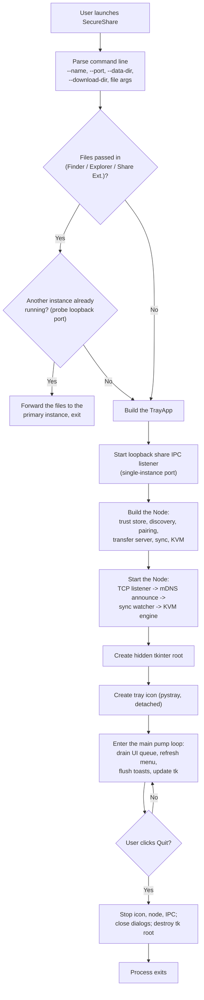
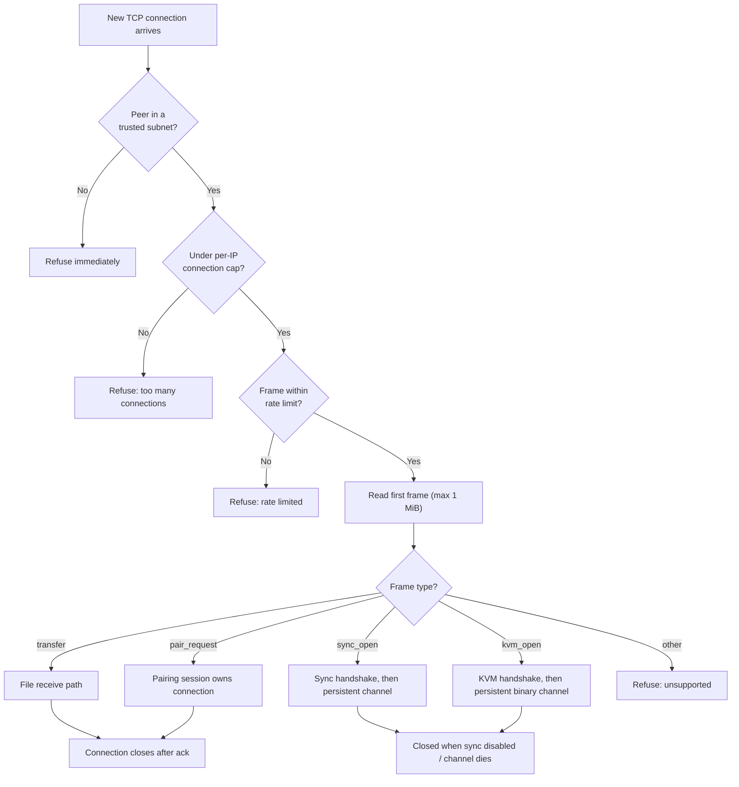

# 3. Startup, Threads, and Lifecycle

## What happens from launch to shutdown

### Step by step

1. **Command line.** The app accepts a device name, data/download
   directories, the TCP port, a maximum accepted transfer size, and
   optional trusted subnets. It also accepts files to share directly
   (`-sendFile`, `secureshare://send?...` URL scheme, or plain paths),
   which come from the macOS Share Extension / Finder Services and the
   Windows right-click verb. *Confirmed from code: `tray/app.py:1233-1261`.*
2. **Single-instance hand-off.** If files were passed and another
   SecureShare instance is already running (it listens on
   `127.0.0.1:48625`), this process forwards the file list over loopback
   and exits. The running instance shows its "Send files to..." dialog.
   *Confirmed from code: `tray/app.py:42-73, 1263-1266`.*
3. **IPC listener.** The new instance binds the loopback port itself, so
   future launches become clients of this one.
   *Confirmed from code: `tray/app.py:219-231`.*
4. **Node construction.** All subsystems are created with shared state:
   the trust store is loaded (or created), and discovery, pairing, the
   transfer server, sync, and KVM are wired to the tray app's callbacks.
   *Confirmed from code: `core/node.py:33-82`.*
5. **Node start.** The TCP listener binds `0.0.0.0:48620` (searching
   upward through `48639` if busy) and begins accepting connections; the
   discovery service announces this device over mDNS and starts browsing
   for peers; the sync and KVM engines start their background threads.
   *Confirmed from code: `core/node.py:86-93`, `core/transfer.py:207-230`,
   `core/discovery.py:95-118`, `core/sync.py:184-189`, `core/kvm.py:704-713`.*
6. **UI.** A hidden tkinter root is created (hidden because the app is a
   menu-bar app, `LSUIElement`), the tray icon starts detached, and the
   main thread enters the pump loop. *Confirmed from code:
   `tray/app.py:150-183`.*
7. **The pump.** The main thread waits on a queue; whenever the Node (or
   an IPC client) posts work, the main thread runs it — updating the
   menu, showing dialogs, updating transfer bars, flushing
   notifications. Between messages it refreshes the menu at most every 2
   seconds and lets tkinter process its own events. *Confirmed from code:
   `tray/app.py:378-404`.*
8. **Shutdown.** Quit stops the icon, closes pairing sessions and
   dialogs, stops the Node (KVM → sync → discovery → transfer server),
   closes the IPC listener, and destroys the tkinter root.
   *Confirmed from code: `tray/app.py:185-215`, `core/node.py:95-111`.*

## The thread map

*Confirmed from code: thread names and launch sites below.*

| Thread | What it does | Started by |
|---|---|---|
| Main | tkinter root, tray icon, the queue pump (all UI) | `TrayApp.run` (`tray/app.py:183`) |
| `transfer-server` | Accepts TCP connections; spawns a handler per connection | `TransferServer.start` (`core/transfer.py:226`) |
| `transfer-conn` (per connection) | Reads the first frame and runs the protocol (transfer, pairing, sync, KVM inbound) | `TransferServer._accept_loop` (`core/transfer.py:255`) |
| `mcast-resolve` | Polls mDNS for service resolution (addresses/ports) | `Discovery.start` (`core/discovery.py:115`) |
| `sync-watch` | Polls the clipboard every 400 ms | `SyncEngine.start` (`core/sync.py:186`) |
| `sync-connect` | Every 5 s, opens sync channels to paired peers | `SyncEngine.start` (`core/sync.py:188`) |
| `sync-out-conn` (per outbound channel) | Reads frames on an outbound sync channel | `SyncEngine.ensure_connections` (`core/sync.py:419`) |
| `kvm-connect` | Every 5 s, opens KVM channels to paired peers | `KVMEngine.start` (`core/kvm.py:708`) |
| `kvm-watchdog` | Every 200 ms: handoff deadlines, pending-sweep, keyboard health | `KVMEngine.start` (`core/kvm.py:711`) |
| `kvm-send-*` (per channel) | Writes queued KVM events to the socket (priority + coalescing) | `KvmChannel.__init__` (`core/kvm.py:333`) |
| `kvm-out-conn` (per outbound channel) | Reads frames on an outbound KVM channel | `KVMEngine.ensure_connections` (`core/kvm.py:995`) |
| `kvm-tap` / `kvm-hooks` | OS input capture (macOS CGEventTap run loop / Windows message pump) | platform `start()` |
| `pair-init`, `send-file`, `share-ipc`, `pair-wait` | User-triggered blocking work (pairing, sending, IPC serving, pairing confirmation wait) | tray app / pairing manager |

## Why this threading design exists

Two hard constraints shape it:

1. **tkinter wants its widgets on the main thread.** pystray can run
   detached, but all dialogs are tkinter, so the UI thread must be the
   main thread. Hence the queue: background threads never touch widgets;
   they post `(function, args)` tuples and the pump executes them.
   *Confirmed from code: `tray/app.py:1-12`.*
2. **Network and input work must never block the UI.** Sending a 10 GiB
   file, waiting for a pairing reply, or forwarding a flood of mouse
   events must not freeze the menu — so each activity runs on its own
   daemon thread.

The result: a busy node has roughly a dozen daemon threads, all
terminating with the process, all coordinated through locks inside the
core modules (the sync engine, KVM engine, trust store, and connection
limiter each own their own lock discipline).

## Lifecycle of one TCP connection

Every incoming connection follows the same admission gate
(*confirmed from code: `core/transfer.py:262-320`*):

The subnet check, connection cap, and rate limit all happen *before* any
protocol logic, so an unauthenticated flood cannot consume pairing/sync/KVM
resources. *Confirmed from code: `core/transfer.py:266-297`,
`core/limits.py:36-81`.*

## Startup ordering detail (why listener first)

The listener binds first, and only then does discovery announce the port it
actually got (the port may differ from 48620 if it was busy). If discovery
ran first, it could advertise a wrong port. *Confirmed from code:
`core/node.py:86-93`.*