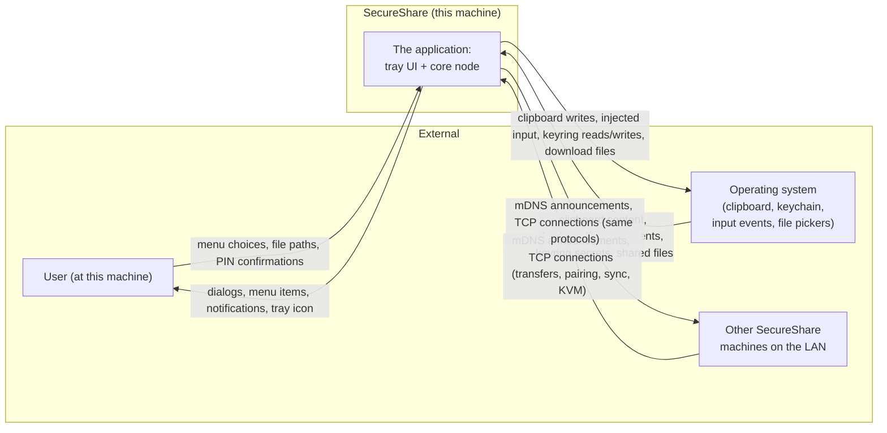
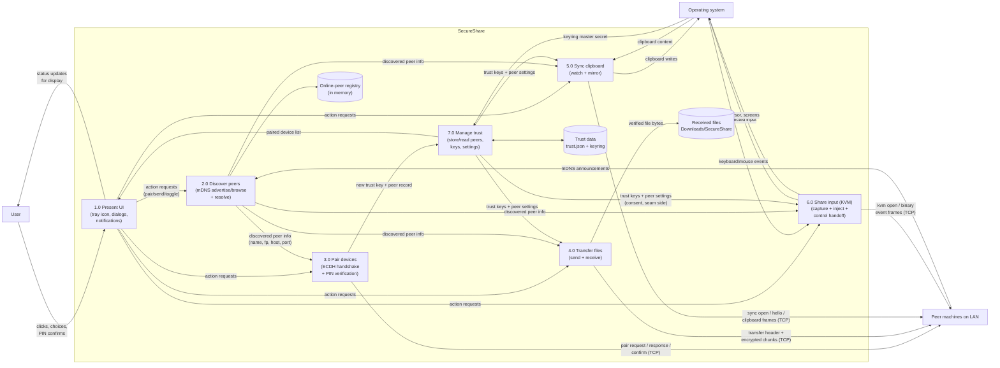
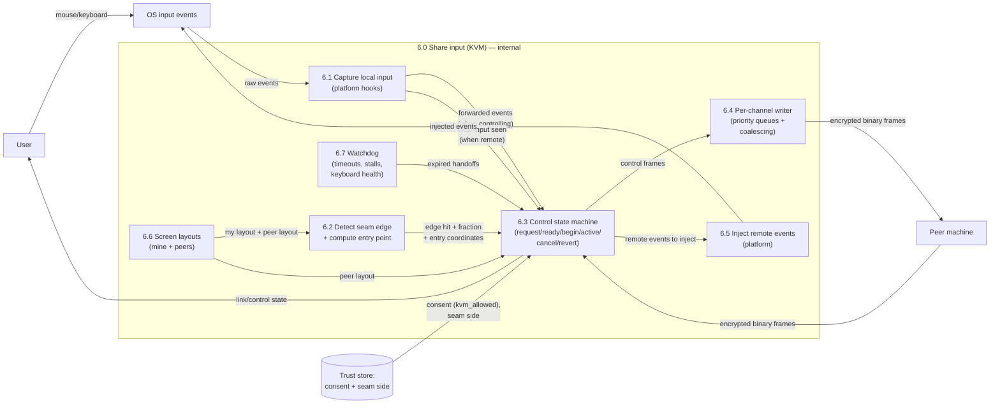

# 4. Data-Flow Diagrams

## DFD Level 0 — Context diagram

The entire application is one system. All data enters and leaves through
the user, the OS, and the LAN.

### How to read this diagram

The user gives the app intent (what to do, which file, whether to accept
a pairing). The OS feeds it passive data (whatever is on the clipboard,
whatever keys the user presses). The LAN feeds it active data (messages
from other SecureShare machines). Everything the app produces goes back
to exactly those three: UI output to the user, OS writes (clipboard,
injected input, files on disk), and network traffic to peers. Nothing
leaves the machine in any other direction — there is no Internet leg.

---

## DFD Level 1 — Major processes and stores

### Walking through each process

| Process | Information in | What happens | Information out | Stored in |
|---|---|---|---|---|
| **2.0 Discover peers** | mDNS announcements (multicast) | Parses service records; resolves addresses in a background thread; maintains a live registry of online devices | "Device X is at IP:port" records | In-memory registry |
| **3.0 Pair devices** | Pair request/response frames + human PIN confirmation | ECDH key exchange; both sides derive a trust key and a 6-digit PIN; trust is stored only after both humans confirm | A stored trust key + peer record | Trust data store |
| **4.0 Transfer files** | File header + encrypted chunks (incoming); local file path (outgoing) | Validates sender against trust store; streams chunks; authenticates every chunk; writes via temp file + atomic rename | Encrypted chunks / verified file bytes + completion ack | Received-files folder |
| **5.0 Sync clipboard** | Clipboard snapshots; encrypted sync frames | Polls clipboard; sends changes to all paired peers; validates sequence + authenticity of received frames; writes to local clipboard | Clipboard writes; encrypted frames | None (no history) |
| **6.0 Share input (KVM)** | OS keyboard/mouse events; encrypted binary event frames | Captures local input; forwards when controlling; injects peer events when remote; runs an acknowledged control handoff | Injected events; encrypted event frames | None (transient state only) |
| **7.0 Manage trust** | Keyring master secret; peer records | Encrypts/decrypts the store; adds/removes peers; persists settings | Encrypted store file | Trust data store (disk + keyring) |
| **1.0 Present UI** | Status events, sessions, transfer progress, peer lists | Converts engine events into menu items, dialogs, toasts; forwards user intent to processes | UI output; action requests | None |

*All confirmed from code: `core/discovery.py`, `core/pairing.py`,
`core/transfer.py`, `core/sync.py`, `core/kvm.py`, `core/trust_store.py`,
`tray/app.py`.*

---

## DFD Level 2 — KVM control handoff (the one process worth breaking down)

The other processes are effectively linear (discovery → registry;
transfer → file; sync → clipboard). The KVM process contains a real
decision machine, so it gets its own diagram.

### Walkthrough (plain English)

1. The user moves the mouse toward the shared screen edge. The OS input
   events arrive at the capture layer, which forwards them to the state
   machine.
2. The state machine checks whether the cursor has entered the narrow
   "jump zone" at the seam edge, and asks the geometry layer for the
   entry point: where the cursor should land on the peer's screen,
   scaled proportionally so different screen sizes line up.
3. The state machine asks the trust store whether this peer is allowed
   to control this machine, and checks both sides' screen layouts agree.
4. If allowed, an acknowledged handshake happens over the encrypted
   channel (request → ready → begin → active). Only after the peer
   confirms readiness does the state machine suppress local input.
5. While control is active, captured events are queued to a per-channel
   writer, which prioritizes control/key frames over mouse motion and
   coalesces rapid mouse deltas into single frames, then encrypts and
   sends them.
6. Incoming frames from the peer are decrypted, validated, and injected
   into the OS; when the controlled machine's own user touches its mouse
   or keyboard, that immediately triggers a revert and control returns.
7. A watchdog expires stalled handshakes and detects a stalled keyboard
   stream (the macOS "Secure Input" symptom), restarting the capture tap
   as a recovery.

*Confirmed from code: `core/kvm.py` (whole module), `core/kvm_geometry.py`,
`core/kvm_events.py`, `core/kvm_platform_mac.py`, `core/kvm_platform_win.py`.
Full detail in [10-kvm-deep-dive.md](10-kvm-deep-dive.md).*