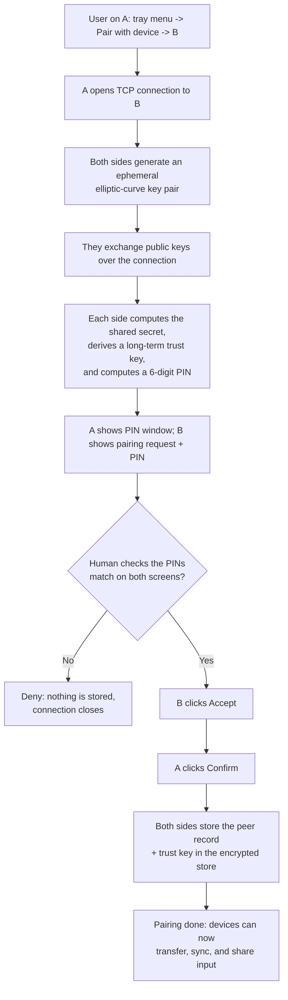
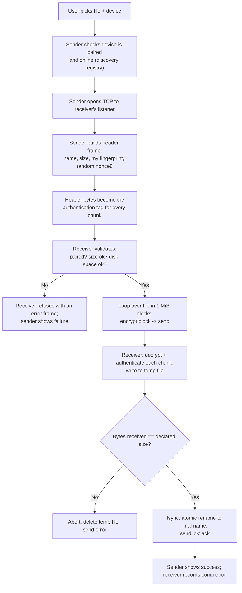
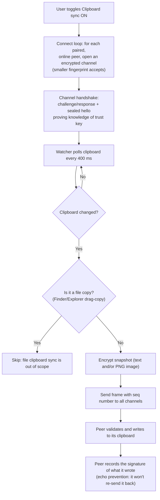
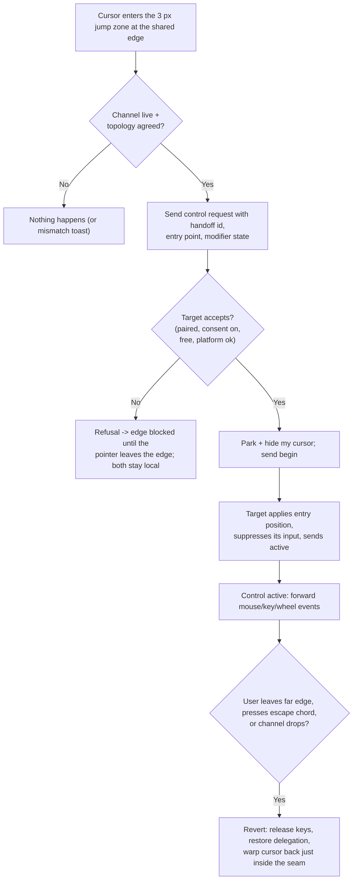
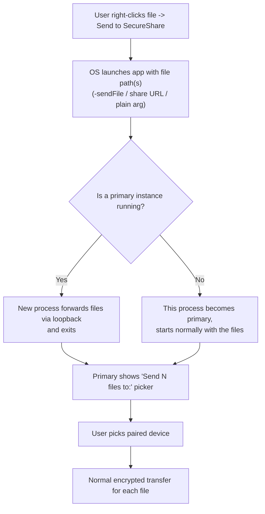

# 5. Major User Workflows

## Workflow 1 — Pairing a new device

### What the user is trying to accomplish

Two machines that have never met should permanently trust each other so
that file transfer, clipboard sync, and KVM work without asking again.

### Step-by-step flow

1. Both machines run SecureShare and can see each other online (via mDNS).
2. On machine A, the user opens the tray menu → **Pair with device** →
   picks machine B.
3. A window appears on machine A showing a 6-digit PIN. A request window
   appears on machine B showing the *same* PIN.
4. The user checks that both screens show the same number (they might
   read it aloud, or glance across the room). This is the
   human-verified, out-of-band check.
5. On machine B (the responder) the user clicks **Accept**.
6. On machine A (the initiator) the user clicks **Confirm**.
7. Both machines now store the peer record and the trust key. Future
   communication is automatic and authenticated.

### Flowchart

### Behind the scenes

- The key exchange uses **ECDH (P-256)** with a *fresh ephemeral key per
  pairing attempt*. The shared secret is then fed through HKDF to produce
  a long-term trust key and the PIN.
- The PIN is a hash of the shared secret. If an attacker on the LAN
  swapped public keys (man-in-the-middle), the two machines would compute
  *different* secrets and show *different* PINs — the human check catches
  this. This is the core security property of the whole system.
- Trust is only written to the store **after both humans confirmed**.
- Pairing has a 60-second timeout; sessions that fail or are denied are
  cleaned up.
- If device B's user clicks **Deny**, or A's user clicks **Deny**, the
  handshake is aborted and no trust is stored.

### Implementation reference

- Tray menu "Pair with device": `TrayApp._pair_submenu` → `_start_pairing`
  — `tray/app.py:1074-1138`
- Initiating the handshake: `Node.pair_with` → `PairingManager.initiate` —
  `core/node.py:134-139`, `core/pairing.py:186-229`
- Responding: `PairingManager.on_pair_request` — `core/pairing.py:167-182`
- PIN/keys: `crypto.derive_trust_key`, `crypto.derive_pin` —
  `core/crypto.py:36-76`
- Storing trust: `TrustStore.add_peer` — `core/trust_store.py:186-195`
- PIN dialogs: `TrayApp._show_pair_dialog` — `tray/app.py:529-580`

---

## Workflow 2 — Sending a file

### What the user is trying to accomplish

Copy a file from this machine to a paired machine, over the LAN,
encrypted and verified.

### Step-by-step flow

1. The user opens the tray menu → **Send file to** → picks the target
   device, then chooses the file in the file dialog.
   *(Alternatively, the user right-clicks a file in Finder/Explorer and
   picks "Send to SecureShare" — see Workflow 6.)*
2. A transfer row appears in the menu with a progress bar.
3. The sender derives a one-time transfer key from the trust key and a
   fresh random nonce, and opens a TCP connection to the receiver's
   listener.
4. The sender streams the file in 1 MiB chunks. Every chunk is encrypted
   (AES-GCM) with its own unique nonce; the exact header bytes
   authenticate every chunk.
5. The receiver checks the sender is paired, validates the header (size
   caps, free disk space, name safety), decrypts and authenticates each
   chunk, and writes to a temporary file.
6. When the last chunk is verified and the byte count matches, the
   receiver atomically renames the temp file to its final name (adding
   `-1`, `-2`, ... if the name is taken) and sends back an "ok"
   acknowledgment.
7. The sender shows the transfer as complete; the file sits in the
   receiver's `Downloads/SecureShare` folder.

### Flowchart

### Behind the scenes

- The header frame contains the *sender's* persistent fingerprint, so the
  receiver can look the sender up in its trust store and pick the right
  trust key. An unpaired sender is refused before a single byte is read.
- Every chunk is authenticated: a tampered chunk, or a tampered header,
  fails AES-GCM and the transfer is aborted. Chunks are decrypted with a
  nonce composed of the 8 random header bytes plus a 32-bit chunk
  counter — unique for every chunk of every transfer, so nonce reuse is
  impossible.
- Memory use stays flat: chunks are streamed, never loaded whole.
- Safety rails: max transfer size (default 10 GiB), 4 MiB chunk guard,
  1 MiB free-space margin, filename sanitized to its basename, path
  collision handled by suffixing.
- The receiver writes to a hidden `.part-*` temp file in the download
  directory and only renames it into place after *all* chunks verified
  and the total size matched. A crash or refusal never leaves a partial
  file at the final path.

### Implementation reference

- Menu → pick file: `TrayApp._pick_and_send`, `_send_to` —
  `tray/app.py:1151-1191`
- Sending: `Node.send_file` → `transfer.send_file` —
  `core/node.py:115-130`, `core/transfer.py:105-167`
- Receiving: `TransferServer._handle_transfer` —
  `core/transfer.py:321-438`
- Path collision reservation: `_reserve_path` / `_release_path` —
  `core/transfer.py:440-456`
- Per-chunk nonce: `crypto.chunk_nonce` — `core/crypto.py:79-87`

---

## Workflow 3 — Clipboard sync (text and images)

### What the user is trying to accomplish

Copy text or an image on one machine and paste it on another, with no
manual file transfer.

### Step-by-step flow

1. The user enables **Clipboard sync** in the tray menu (off by default;
   the setting persists).
2. Each machine opens one persistent encrypted "sync channel" to each
   paired, online peer. To avoid double connections, the device with the
   lexicographically smaller fingerprint accepts the connection; the
   other initiates.
3. The user copies text (Cmd/Ctrl+C) or an image (screenshot, copied
   image) on machine A.
4. Within ~400 ms, A's watcher notices the clipboard changed, encrypts
   the content, and sends it over the channel to every paired peer.
5. Machine B receives the frame, verifies it (authenticity, sender,
   sequence number), and writes it to its own clipboard.
6. The user pastes on machine B.

### Flowchart

### Behind the scenes

- The watcher uses a cheap OS clipboard revision counter where available
  (NSPasteboard `changeCount` on macOS, `GetClipboardSequenceNumber` on
  Windows) to skip full reads when nothing changed.
- **Echo prevention:** whenever the app itself writes the clipboard
  (its own change, or a received frame), it immediately re-reads and
  records the signature. The next poll can then never mistake its own
  write for a new local change — so content does not bounce back and
  forth between machines.
- File copies (drag-copy in Finder/Explorer) are detected and **never
  synced**.
- Images travel as PNG (macOS screenshots are TIFF on the pasteboard and
  are converted; Windows DIB is converted; the peer receives PNG and the
  receiving OS converts back).
- Each frame carries a per-direction monotonic sequence number baked into
  the authenticated metadata. Duplicates are dropped, stale frames are
  dropped, and a sequence *gap* is treated as an attack: the channel is
  closed rather than accepting an out-of-order stream.
- If the connection drops, the connect loop retries every 5 seconds.
- The channel key binds protocol version, both fingerprints, the role,
  and both nonces — a spoofed open cannot produce a key the peer accepts;
  the first sealed frame proves knowledge of the trust key before any old
  channel is replaced.

### Implementation reference

- Toggle: `TrayApp._toggle_sync` → `SyncEngine.set_enabled` —
  `tray/app.py:1058-1072`, `core/sync.py:197-206`
- Watcher loop: `SyncEngine._watch_loop` / `_watch_once` —
  `core/sync.py:423-470`
- Outbound connect: `SyncEngine.ensure_connections` — `core/sync.py:350-419`
- Inbound handshake + channel: `SyncEngine.on_inbound` — `core/sync.py:210-278`
- Frame validation: `SyncEngine.handle_frame` — `core/sync.py:294-330`
- Platform clipboard: `core/clipboard.py`, `core/clipboard_mac.py`,
  `core/clipboard_win.py`

---

## Workflow 4 — Mouse & keyboard sharing (KVM): takeover

### What the user is trying to accomplish

Drive machine B's pointer and keyboard from machine A by moving the mouse
across the screen edge — a modern software KVM switch. (A full engine
deep-dive is in [10-kvm-deep-dive.md](10-kvm-deep-dive.md); this is the
user-visible flow.)

### Step-by-step flow

1. On both machines, the user enables **Mouse & keyboard sharing** in the
   tray menu (macOS asks for Accessibility/Input Monitoring permission
   the first time).
2. In **Mouse & keyboard devices…**, the user tells each machine where
   the other one sits ("This device is on the *right* side of this Mac"),
   and — on the machine that may be driven — enables **Allow this device
   to control this Mac**.
3. Both machines open a persistent encrypted KVM channel and exchange
   screen layouts. If the two placements disagree, both sides show a
   layout-mismatch toast and the seam stays inert (a deliberate safety
   choice).
4. On machine A, the user moves the cursor into the 3 px "jump zone" at
   the shared screen edge. A's cursor parks and hides at its screen
   center while B is asked, "may I take over?"
5. B validates: paired? consent on? layouts agree? no other active
   controller? platform available? If yes, B prepares and acknowledges.
6. A confirms it is about to take over; only then does B suppress its
   local input, move its cursor to the mirrored entry position, and
   confirm "active". From that moment A's mouse and keyboard drive B.
7. The user moves the mouse; A forwards events; B injects them. The
   cursor appears on B at the proportional position matching where the
   user crossed the seam on A.

### Flowchart (controller side)

### Behind the scenes

- **Control is acknowledged, never a blind grab.** The controller keeps
  its own input unsuppressed until the target has confirmed *active*;
  the target suppresses input only after the controller confirmed
  *begin*. A peer that never confirms readiness can never suppress
  anything.
- **Handing control back** happens four ways: the user moves the
  physical mouse / presses a key / scrolls on the *controlled* machine
  (local input reclaims it), the cursor reaches the *far* edge of the
  controlled screen (smooth extended-display-style return), the escape
  chord **Ctrl+Alt+Space** (Ctrl+Option+Space on macOS) is pressed on
  either machine, or the channel is lost.
- **Safety latches:** after control returns, the former controller's edge
  stays latched for 2 seconds (a revert grace) and refuses to re-acquire
  on residual motion; a *refusal* latches the edge until the pointer
  clearly leaves it, so the refusal toast appears at most once per edge
  dwell.
- Keys held down on either side are released automatically when control
  changes hands or the link drops (an `all-keys-up` frame reconciles both
  sides).
- One active control at a time. If two machines request simultaneously,
  the higher fingerprint wins deterministically.

### Implementation reference

- Menu switches: `TrayApp._toggle_kvm`, `_set_kvm_allowed`,
  `_set_kvm_side`, per-peer status labels — `tray/app.py:928-1056`
- Engine entry: `KVMEngine` — `core/kvm.py:542-2000`
- Seam detection: `on_local_mouse` — `core/kvm.py:1108-1152`
- Geometry math: `core/kvm_geometry.py`
- Handoff protocol codec: `core/kvm_events.py`
- Platform capture/injection: `core/kvm_platform_mac.py`,
  `core/kvm_platform_win.py`

---

## Workflow 5 — Sharing from the OS (Finder / Explorer)

### What the user is trying to accomplish

Send a file without opening SecureShare's own dialog: right-click in the
file manager.

### Step-by-step flow

1. The user right-clicks a file.
   - **macOS**: Quick Actions/Services → **Send to SecureShare** (built-in
     NSServices; no signing needed). On macOS 26+, a native Share
     Extension (`com.apple.share-services`) is embedded in the signed
     app bundle instead.
   - **Windows**: right-click → **Send with SecureShare** (a registry
     verb installed by `scripts/install_windows_share.ps1`).
2. The OS launches SecureShare (or wakes the running instance) with the
   file path(s).
3. If an instance is already running, the new process forwards the file
   list over the loopback IPC port and exits — the primary instance shows
   its "Send N file(s) to:" picker.
4. The user picks a paired device; each file goes through the normal
   encrypted send path.

### Flowchart

### Behind the scenes

- The macOS Share Extension (`native/share_extension/`, Swift) extracts
  up to 5 file URLs from the share context and hands them to the app via
  the `secureshare://send?files=...` URL scheme — the app parses that in
  `parse_share_argv`. The Windows verb simply runs `SecureShare.exe
  "<path>"`.
- The loopback IPC port (48625) is the single-instance arbiter: whoever
  binds it is the primary; everyone else becomes a forwarder. Batched
  files are aggregated for 1.5 s so a multi-file share opens one dialog.
- Only files that exist and are readable are accepted into the picker.

### Implementation reference

- URL/argv parsing + forwarding: `tray/app.py:47-73, 1203-1230`
- IPC server: `tray/app.py:219-270`
- Picker: `TrayApp._show_share_dialog`, `_send_share_batch` —
  `tray/app.py:299-353`
- macOS extension: `native/share_extension/ShareViewController.swift`,
  `native/share_extension/Info.plist`
- Windows verb: `scripts/install_windows_share.ps1`
- NSServices registration: `secure-share-mac.spec` (Info.plist entry)

---

## Workflow 6 — Unpairing a device

### What the user is trying to accomplish

Permanently remove a device from the trust store; all future
communication with it stops.

### Step-by-step flow

1. Tray menu → **Unpair device** → pick the device.
2. A confirmation dialog asks "Unpair <name>?".
3. On confirm, the peer record (and its trust key) is deleted from the
   encrypted store and saved.
4. The peer is no longer listed for sending; incoming transfers, sync
   opens, and KVM opens from it are refused with "device is not paired".

### Implementation reference

`TrayApp._unpair` → `TrustStore.remove_peer` — `tray/app.py:1193-1200`,
`core/trust_store.py:197-200`.

---

## Workflow 7 — Diagnostics (KVM log book)

### What the user is trying to accomplish

Inspect what the KVM engine is doing when something misbehaves.

### Step-by-step flow

1. Tray menu → **KVM log book…** opens a window that continuously
   appends every engine status message (all levels, not just errors).
2. Buttons: **Dump diagnostics** prints a structured snapshot of the
   engine (per-peer states, handoff records, blocked edges, request and
   revert logs, platform counters); **Copy** / **Clear** manage the
   content.

### Implementation reference

`tray/logbook.py` (whole file), wired via `TrayApp._kvm_diagnostics` →
`KVMEngine.diagnostics` — `tray/app.py:454-460`, `core/kvm.py:670-700`.

> Note: `logbook.py`'s docstring says "temporary … remove after use" —
> it is a diagnostics aid shipped in the current tree. *Confirmed from
> code: `tray/logbook.py:1-2`.*