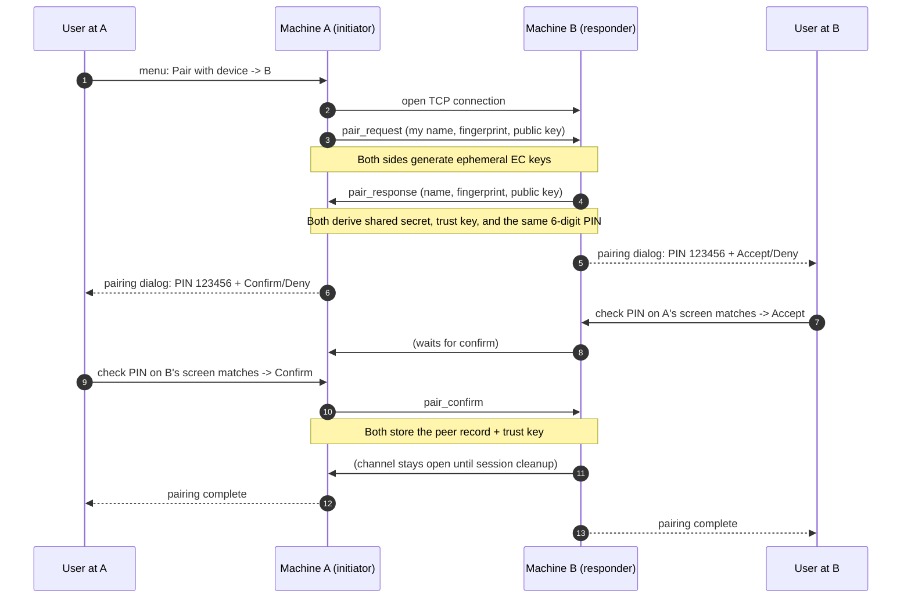

# 6. Sequence Diagrams

## 6.1 Pairing two devices



### Step-by-step

1. A opens a TCP connection to B's listener and sends its identity plus
   an ephemeral public key.
2. B answers with its own identity and public key. Both sides now compute
   the ECDH shared secret — this is the magic step: each side combines
   its own private key with the *other's* public key, and both arrive at
   the same number without ever transmitting it.
3. From that secret both derive the long-term trust key and the PIN. The
   PIN is deterministic: both screens show the same 6 digits.
4. Both humans verify the PINs visually, then B accepts and A confirms.
5. Only now do both sides persist the trust key, keyed by the other
   device's fingerprint.

*Confirmed from code: `core/pairing.py:60-229` (PairingSession +
PairingManager).*

---

## 6.2 Sending a file

```mermaid
sequenceDiagram
    autonumber
    participant U as User
    participant S as Sender (machine A)
    participant R as Receiver (machine B)

    U->>S: pick device + file
    S->>S: look up peer (must be online + paired); get trust key
    S->>R: open TCP to listener
    S->>R: header frame (name, size, fingerprint, random nonce8)
    Note over S,R: header bytes become the auth tag for every chunk
    R->>R: validate: paired? size caps? disk space? path collision?
    alt validation fails
        R-->>S: error frame (refused)
        S-->>U: "send failed"
    else validation ok
        loop every 1 MiB block
            S->>S: encrypt block (AES-GCM, nonce = nonce8 + counter)
            S->>R: [8-byte length][ciphertext]
            R->>R: decrypt + authenticate, write to .part- temp file
        end
        R->>R: fsync; rename temp file to final name
        R-->>S: ok frame (bytes received)
        S-->>U: progress 100%
        R-->>U2: file appears in Downloads/SecureShare
    end
```

### Step-by-step

1. The sender verifies the peer is in the discovery registry and the
   trust store, then opens a connection to the peer's listener.
2. The sender derives a one-time transfer key from the stored trust key
   plus a random 8-byte nonce, and sends the JSON header describing the
   file. The *exact bytes* of that header are later authenticated
   together with every chunk — if the header were modified in transit,
   decryption of every chunk would fail.
3. The receiver runs its admission checks (paired sender, size limits,
   free space, safe filename, collision-safe final path).
4. Chunks stream in a loop. The receiver writes into a temp file and
   only renames it to the final name once the byte count matches the
   declared size. Any failure deletes only the temp file.
5. An "ok" frame closes the protocol; the sender reports success.

*Confirmed from code: `core/transfer.py:105-167` (sender),
`core/transfer.py:321-438` (receiver).*

---

## 6.3 Clipboard sync channel (text example)

```mermaid
sequenceDiagram
    autonumber
    participant A as Machine A (initiator, smaller fingerprint)
    participant B as Machine B (responder)
    participant OS as OS clipboard

    Note over A,B: sync enabled on both sides
    A->>B: sync_open (version, fingerprint, random nonce)
    B->>B: check: paired? sync enabled? version?
    B->>A: sync_ack (version, fingerprint, my random nonce)
    Note over A,B: both derive channel key (binds version, fingerprints, roles, nonces)
    A->>B: sync_hello — AES-GCM sealed with the channel key (proof of trust key)
    B->>B: decrypt hello; only if it verifies may the old channel be replaced
    B->>A: sync_ok
    Note over A,B: persistent encrypted channel established

    loop watcher every 400 ms
        A->>OS: read clipboard revision counter
    end
    OS-->>A: changed
    A->>OS: read snapshot (text)
    A->>B: clipboard_text frame (seq N, sealed payload)
    B->>B: validate seq = N (monotonic), sender, authenticity
    B->>OS: write text to clipboard
    B->>B: record clipboard signature (echo prevention)
    Note over B: A's watcher will now see B's write as "already seen"
```

### Step-by-step

1. The smaller-fingerprint device initiates the channel to avoid two
   simultaneous connections between the same pair.
2. The handshake is a challenge/response: each side contributes a random
   nonce; the channel key is derived from the trust key plus *everything*
   that identifies this specific channel (version, fingerprints, roles,
   both nonces). The initiator must then seal a hello frame with that key
   — proving it knows the trust key — before the responder replaces any
   existing channel.
3. The watcher polls cheaply (revision counter), reads content only when
   it changed, and forwards encrypted frames with monotonic sequence
   numbers.
4. The receiver validates sequence and authenticity, writes the
   clipboard, and immediately records the new signature so its own
   watcher never echoes the content back.

*Confirmed from code: `core/sync.py:165-330` (engine + channel),
`core/sync.py:423-470` (watcher).*

---

## 6.4 KVM takeover and hand-back

```mermaid
sequenceDiagram
    autonumber
    participant U as User (at A)
    participant A as Machine A (controller)
    participant B as Machine B (target, consent granted)

    Note over A,B: persistent encrypted KVM channel already linked; layouts exchanged
    U->>A: move cursor into the 3 px seam jump zone
    A->>A: compute entry point on B's screen (proportional mapping)
    A->>B: CONTROL_REQUEST (handoff id, entry x/y, modifier mask)
    B->>B: validate: paired, consent, topology, free, platform
    B->>A: CONTROL_READY (handoff id)
    A->>A: park + hide cursor (input still NOT suppressed)
    A->>B: CONTROL_BEGIN (handoff id)
    B->>B: suppress local input; warp to entry point; apply modifiers
    B->>A: CONTROL_ACTIVE (handoff id)
    Note over A,B: control active — A's input drives B
    loop while active
        U->>A: mouse/keyboard events
        A->>B: encrypted event frames
        B->>B: inject events into OS
    end
    U->>A: move cursor past B's far edge (or press escape chord, or touch B's mouse)
    B->>A: CONTROL_REVERT (handoff id, reason)
    Note over A,B: both restore local control; keys released; cursor warped back just inside the seam
```

### Step-by-step

1. The takeover is a four-message acknowledgment dance
   (request → ready → begin → active). The critical safety property: the
   target suppresses its input only *after* the controller has committed
   with `begin`, and the controller suppresses its input only *after*
   the target confirmed `active`. Neither side can ever be suppressed by
   a peer that has not proven itself ready.
2. During the active session, captured events stream through the
   encrypted channel and are injected by the platform layer.
3. Hand-back is triggered by explicit signals (far edge, escape chord,
   physical input on the target, channel loss) and is always
   accompanied by key-state reconciliation (an `all-keys-up` frame) so a
   held key on either side cannot get stuck down.

*Confirmed from code: `core/kvm.py:1349-1487` (controller side),
`core/kvm.py:1491-1627` (target side + failures), `core/kvm.py:1631-1677`
(reverts).*