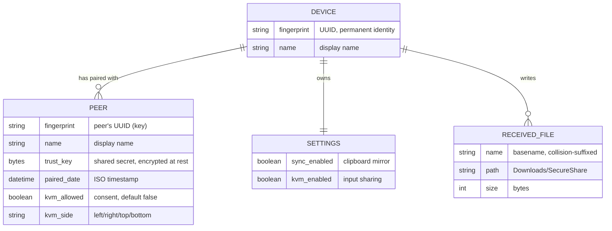

# 7. Storage and Trust Data

The project has no traditional database. Its persistent state is one JSON
file plus the OS keyring. Everything else is ephemeral (in-memory) or is
received files on disk.

## What is stored, and why

### 1. The trust store (`trust.json`)

**Where:** platform app-data directory:

| OS | Path |
|---|---|
| macOS | `~/Library/Application Support/SecureShare/trust.json` |
| Windows | `%APPDATA%\SecureShare\trust.json` |
| Linux (best-effort) | `$XDG_CONFIG_HOME` or `~/.config` + `SecureShare` |

*Confirmed from code: `core/trust_store.py:34-41`.*

**What it holds:**

| Field | Meaning |
|---|---|
| `identity.fingerprint` | This device's permanent UUID. Never changes (unless the store is deleted). Every protocol uses it as this device's name/ID. |
| `identity.name` | The human-friendly device name shown in menus (default: OS hostname). |
| `peers` | One record per paired device, keyed by the *peer's* fingerprint. |
| `peers[name]` | Peer's display name (as it introduced itself during pairing). |
| `peers[trust_key]` | The long-term symmetric key established during pairing. This is the master credential for all communication with that peer. |
| `peers[paired_date]` | When the pairing happened (ISO timestamp). |
| `peers[kvm_allowed]` | Whether this peer may take over this machine's keyboard & mouse (default **false** — consent is opt-in per peer). |
| `peers[kvm_side]` | Which edge of this screen the peer sits at (`left/right/top/bottom`, default `right`). |
| `sync_enabled` | Whether clipboard sync is on (persisted toggle). |
| `kvm_enabled` | Whether KVM is on (persisted toggle). |
| `version` | Store format version (1). |

*Confirmed from code: `core/trust_store.py:84-102` (`_to_payload`).*

**Why it exists:** without a persistent record of who is trusted and what
the keys are, the user would have to re-pair on every launch. The file is
the "address book" + "key ring" of the app.

### 2. The keyring (master secret)

The trust file's sensitive contents (the trust keys) are encrypted at
rest with Fernet (AES-128-CBC + HMAC). The Fernet key is derived from a
32-byte random master secret stored in the OS credential vault:

- macOS **Keychain** (service `SecureShare`, account `trust-master`)
- Windows **Credential Manager** (same names)

*Confirmed from code: `core/trust_store.py:44-55, 77-80`.*

**Fallback:** if the keyring is unavailable (headless session, locked
credential vault, missing backend), the store is written as plaintext
JSON with `0600` permissions (owner-only). This is a documented tradeoff:
availability over at-rest encryption. *Confirmed from code:
`core/trust_store.py:148-167`; also documented in `README.md`.*

### 3. Received files

Sent files land in `~/Downloads/SecureShare/` (or
`%USERPROFILE%\Downloads\SecureShare` on Windows), configurable via
`--download-dir`. Temporary `.part-*` files live in the same directory
and are deleted on failure. *Confirmed from code:
`core/transfer.py:100-102, 387-389`.*

### 4. In-memory only (never persisted)

- The discovery registry (who is online *right now*).
- KVM link/control state, handoff records, blocked-edge latches,
  diagnostics logs.
- Sync channels.
- The share-file picker batches.

## When is each piece created / read / updated / deleted?

| Operation | When | Mechanism |
|---|---|---|
| Store file created | First launch (or first pairing) | `TrustStore.__init__` creates the directory; `save()` writes the file |
| Identity created | First launch | random UUID + hostname |
| Identity updated | User sets `--name` | `TrustStore.set_name` |
| Peer record created | Successful pairing (both sides) | `PairingSession` → `TrustStore.add_peer` |
| Peer record updated | KVM consent toggled / seam side changed | `set_peer_kvm_allowed`, `set_peer_kvm_side` |
| Peer record deleted | User unpairs | `remove_peer` |
| Store read | Every launch, and on every incoming transfer / sync open / KVM open (to fetch the trust key) | `_load` at startup; `get_peer` per connection |
| Store written | Every mutation (identity, peers, toggles) | `save()` — atomic: write `trust.json.tmp` → `os.replace` → chmod 0600 |
| Keyring secret created | First store save | `keyring.set_password` |
| Keyring secret read | Every store load/save while encrypted | `keyring.get_password` |

*Confirmed from code: `core/trust_store.py:61-73, 120-167, 174-242`.*

## Failure behaviors (as coded)

| Failure | Behavior |
|---|---|
| `trust.json` corrupt / unreadable JSON | The app starts with a fresh empty store and **does not destroy the file** (`_load` returns silently). *Confirmed from code: `core/trust_store.py:128-132`.* |
| `trust.json` encrypted but keyring secret missing/wrong | Starts empty rather than crashing (documented tradeoff). *Confirmed from code: `core/trust_store.py:133-145`.* |
| Keyring unavailable at save time | Plaintext fallback with 0600 permissions. *Confirmed from code: `core/trust_store.py:159-162`.* |
| Concurrent same-name transfers | Filenames get `-1`, `-2` suffixes via an in-flight path claim set. *Confirmed from code: `core/transfer.py:440-456`.* |

## ER-style diagram

### Relationships in plain English

- One device (this machine) pairs with many peers. Each pairing is
  symmetric: on machine A the store holds B's fingerprint + trust key;
  on machine B the store holds A's fingerprint + the *same* trust key.
- The trust key is the single shared secret that authenticates all three
  protocols (transfer, sync, KVM) between that pair. There is one key
  per pair, not one per session — sessions derive fresh per-session or
  per-channel keys from it (see [08-authentication-and-security.md](08-authentication-and-security.md)).
- Device settings (sync/KVM toggles) are attributes of this device, not
  of any peer — but KVM consent and seam side are per-peer, because they
  describe a *relationship* (who may control whom, and where they sit).
- Received files are not tracked in the store at all — they are plain
  files in the download folder. The transfer completion callback carries
  the info to the UI at the moment it happens; nothing is indexed later.

*Confirmed from code: `core/trust_store.py`, `core/transfer.py`,
`core/node.py:149-158`.*