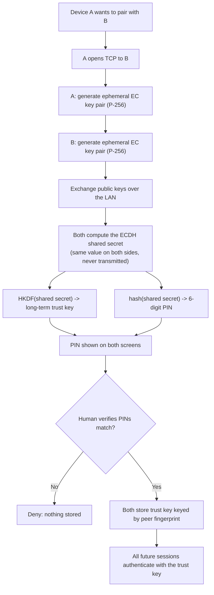
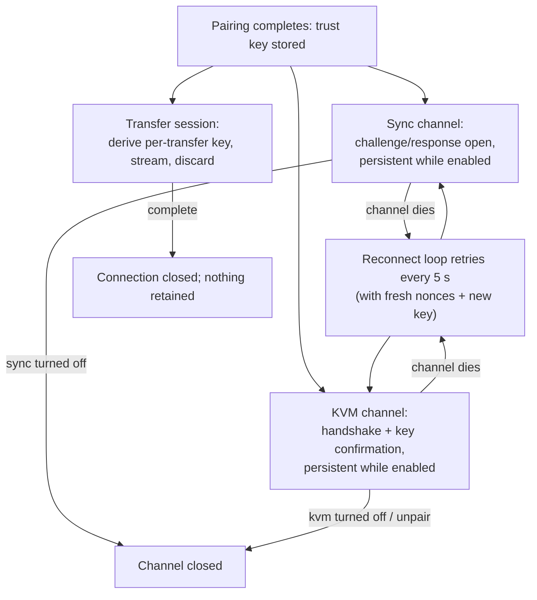

# 8. Authentication, Authorization, and Security

## The trust model in one paragraph

SecureShare uses **trust-on-first-use with out-of-band verification**.
There are no accounts and no passwords. The first time two devices meet,
they perform a cryptographic key exchange and both show a 6-digit PIN;
only when a human on each machine confirms the PINs match is a long-term
trust key stored on both sides. From then on, every protocol authenticates
itself by proving knowledge of that key. Individual *features* then apply
their own consent rules on top (clipboard sync and KVM are off by default;
KVM control additionally requires per-peer consent).

## The pairing (authentication) flow

### Why the PIN defeats a man-in-the-middle

If an attacker on the LAN intercepted the connection and swapped both
public keys, the two honest devices would each compute a *different*
shared secret (one with the attacker, one with the other victim) — and
therefore show **different PINs**. The human check is the authoritative
verification; the cryptography only makes the check meaningful. This is
the Bluetooth/Signal-style out-of-band model. *Confirmed from code:
`core/pairing.py:1-15` (module docstring), `core/crypto.py:71-76`
(PIN derivation).*

## What protects each protocol

Every protocol derives its own *session* or *channel* key from the stored
trust key, so a leaked per-session key does not leak the trust key, and a
compromised session cannot decrypt another session.

| Protocol | Key derivation | Freshness inputs | Tamper/anti-replay |
|---|---|---|---|
| **File transfer** | HKDF(trust_key, random nonce8, `transfer-v1`) | one random 8-byte nonce per transfer | Each 1 MiB chunk: AES-GCM with nonce = nonce8 + 32-bit chunk counter; the exact header bytes are authenticated data (AAD) for every chunk |
| **Clipboard sync** | HKDF(trust_key, salt, `sync-channel-v1`) where salt binds version, both fingerprints, roles, both nonces | two fresh 8-byte nonces (one per side) | Challenge/response open; first frame is a sealed hello proving the key; every frame carries immutable metadata (type, version, fingerprints) + monotonic per-direction sequence number, all as AAD; gaps close the channel |
| **KVM** | HKDF(trust_key, salt, `kvm-v1`), salt binds version, fingerprints, roles, both nonces | two fresh 8-byte nonces | First binary frame is the authenticated key confirmation; every event uses AES-GCM with monotonic per-direction nonce counters |

*Confirmed from code: `core/crypto.py:36-68`, `core/transfer.py:105-167`,
`core/sync.py:54-88, 210-330`, `core/kvm.py:269-281, 434-465,
806-882`.*

### Nonce discipline (why it matters)

AES-GCM fails catastrophically if a nonce is reused with the same key.
SecureShare's discipline:

- **Transfer:** nonce = 8 random bytes (per transfer) + 4-byte chunk
  counter. Even the same file sent twice gets different random bytes,
  hence different nonces. The random part is exchanged in the header;
  the counter part is implicit (chunk index). *Confirmed from code:
  `core/crypto.py:79-87`.*
- **KVM:** the same `chunk_nonce` scheme is reused with per-direction
  nonce halves (each side's outbound nonce is its own random half), so
  both directions have independent counter spaces. The counter limit
  (`1 << 31`) is enforced; channels at the limit stop sending.
  *Confirmed from code: `core/kvm.py:311-325, 366, 440-444`.*

## Authorization rules (who may do what)

| Action | Required | Where enforced |
|---|---|---|
| Connect at all | Peer IP inside `--trusted-subnets` if configured (default: any LAN peer) | Listener, before reading any data — `core/transfer.py:266-274` |
| Open a connection | Per-IP connection cap (8) + token-bucket rate limit (40 req/s/IP) | Listener — `core/limits.py` |
| Send a file | Sender's fingerprint must be in receiver's trust store | Transfer header check — `core/transfer.py:327-334` |
| Open a sync channel | Paired + sync enabled on receiver + handshake proves trust key | `core/sync.py:210-278` |
| Open a KVM channel | Paired + KVM enabled on receiver + key confirmation | `core/kvm.py:806-882` |
| **Take control of a machine** | Paired + **per-peer consent** (`kvm_allowed`, off by default) + topology agreement + no other active controller + input platform available | Target side at takeover time — `core/kvm.py:1491-1553` |
| Share a file from the OS picker | Only real, existing files | `tray/app.py:245-262` |

### Consent granularity

- **Clipboard sync:** one global toggle (persisted). On = mirrored to all
  paired peers.
- **KVM:** a global switch (persisted) plus a **per-peer consent toggle**
  ("Allow this device to control this Mac") and a **per-peer seam side**
  ("This device is on this side of this Mac"). Both sides must configure
  matching seam sides, or the seam is inert with a mismatch toast.
  *Confirmed from code: `core/trust_store.py:90-91, 223-242`,
  `tray/app.py:941-1056`.*

## Session lifecycle

- Transfer keys are single-use and discarded after the transfer.
- Sync/KVM channels are persistent but re-keyed on every reconnect
  (fresh nonces → fresh channel key), and a *replacement* channel only
  takes over after the new one has authenticated itself — a stale or
  spoofed open can never displace a live channel. *Confirmed from code:
  `core/sync.py:210-278`, `core/kvm.py:806-882`.*
- **Logout:** there is no session/session-expiry concept — trust is
  permanent until the user unpairs (or deletes the store). Sessions are
  per-connection and validated per-message; a dead channel is simply
  re-established.

## At-rest protection

- Trust keys are encrypted with Fernet under a key derived from a
  random 32-byte master secret stored in the OS keyring.
- Fallback (no keyring): plaintext file, `0600` permissions.
- Writes are atomic (temp file + rename), so a crash cannot corrupt the
  store. *Confirmed from code: `core/trust_store.py:148-167`.*

## What the user cannot do / defense boundaries

- **No WAN mode** — everything is LAN-only by design; the listener binds
  all interfaces but README warns against port-forwarding.
- **File-copy clipboard sync is never performed** (Finder/Explorer
  drag-copies are detected and skipped).
- **KVM keys outside the standard 104-key US set are dropped at capture**
  (media keys, IME, dead keys are never forwarded).
- **A peer that never confirms readiness cannot suppress local input** —
  the platform delegation is derived only from confirmed state.
  *Confirmed from code: `core/kvm.py:1742-1765`,
  `core/kvm_keymap.py:51-54`.*

## Threat model summary (as coded)

| Threat | Defense |
|---|---|
| LAN man-in-the-middle during pairing | Out-of-band PIN comparison by humans |
| Impersonation after pairing | Knowledge of the trust key required for every protocol |
| Replay of recorded frames | Fresh nonces per session; monotonic per-direction sequence numbers; gap = channel closed |
| Tampered file chunks | AES-GCM authentication of every chunk (header bytes as AAD) |
| Unauthenticated LAN flood / DoS | Per-IP connection cap + token-bucket rate limiter + trusted-subnet gate |
| Stolen `trust.json` | Fernet encryption keyed by OS keyring secret |
| Malicious peer taking over input | Per-peer consent (off by default) + acknowledged handoff + immediate revert on any anomaly |
| Clipboard echo loops | Signature recording after every local write |