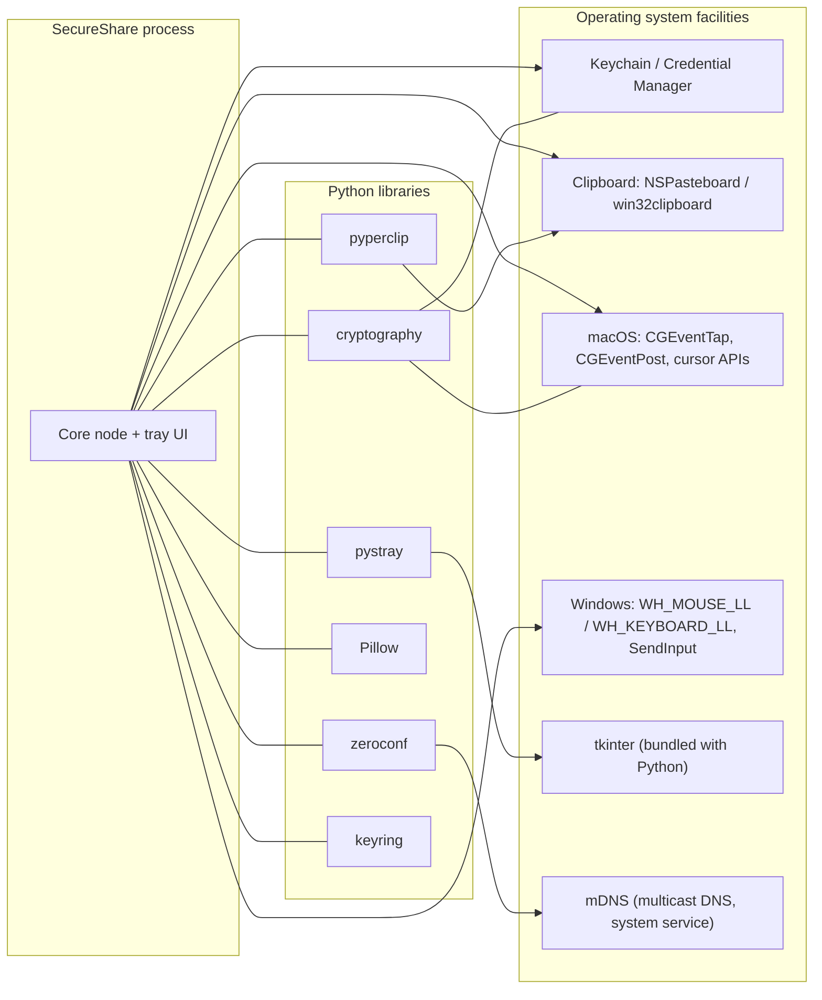

# 9. External Services and Dependencies

SecureShare has **no cloud services and no third-party network APIs**. Its
external dependencies are: (a) Python libraries, and (b) operating-system
facilities. This chapter covers every one that matters, what the app sends
to it, what comes back, and what happens on failure.

## Dependency map

## 9.1 `cryptography` (Python)

- **What:** ECDH (P-256), HKDF-SHA256, AES-GCM, Fernet.
- **What the app sends:** plaintext bytes to encrypt; ciphertext to
  decrypt; public keys to exchange.
- **What comes back:** ciphertexts/plaintexts; an `InvalidTag` exception
  on any tampered or wrong-key input.
- **Failure behavior:** `InvalidTag` is caught at every protocol boundary
  and treated as an authentication failure — the connection is refused or
  closed (e.g. a tampered chunk aborts the transfer; a bad hello fails
  the sync handshake; a bad KVM frame closes the channel). *Confirmed
  from code: `core/transfer.py:401-403`, `core/sync.py:292, 320-323`,
  `core/kvm.py:496-499`.*
- **Used by:** everything that encrypts — transfer, sync, KVM, trust
  store.

## 9.2 `zeroconf` (Python) → mDNS/DNS-SD (system)

- **What:** multicast DNS service advertisement and browsing. This is the
  discovery mechanism: each device announces
  `name-<fp8>._secureshare._tcp.local.` with its IP, port, name, and
  fingerprint, and browses for the same service type.
- **What the app sends:** registration of its own service; DNS queries
  for peer services.
- **What comes back:** service records for peers (name, fingerprint,
  address, port).
- **Failure behavior:** discovery is best-effort and non-fatal. If mDNS
  is unavailable, the app still runs — the user just can't discover
  peers (pairing/transfer would also fail, since those need an address).
  The resolver keeps retrying a peer that fails to resolve instead of
  giving up after N attempts. *Confirmed from code:
  `core/discovery.py:172-237`.*
- **Note:** one deliberate detail — the resolver runs in its own thread
  because zeroconf's blocking `get_service_info` cannot be called from
  the browser callback thread without deadlocking. *Confirmed from code:
  `core/discovery.py:1-9`.*
- *Likely but not fully confirmed:* on networks that block multicast
  (some guest Wi-Fi, AP isolation), discovery silently fails — the
  tests acknowledge this (`tests/test_discovery.py` skips when loopback
  mDNS does not resolve).

## 9.3 `keyring` (Python) → macOS Keychain / Windows Credential Manager

- **What:** stores/retrieves the 32-byte master secret used to encrypt
  the trust store at rest.
- **What the app sends:** the generated master secret (first use) and a
  read request (every load/save).
- **What comes back:** the stored secret, or `None` if absent.
- **Failure behavior:** if the keyring raises or the stored value is
  malformed, the store falls back to plaintext (0600 perms) at write
  time and starts empty at read time. This is the documented availability
  tradeoff. *Confirmed from code: `core/trust_store.py:44-55, 133-145,
  159-162`.*
- *Likely but not fully confirmed:* exact keyring behavior in
  headless/locked sessions varies by OS and desktop environment; the
  code handles "unavailable" generally rather than per cause.

## 9.4 `pystray` + tkinter (UI)

- **What:** the menu-bar/tray icon and the native menu; tkinter provides
  the dialogs (pairing PIN, file picker, transfer window, share picker,
  log book).
- **What the app sends:** menu structure, callbacks, dialog contents.
- **What comes back:** user selections and clicks, executed on the main
  thread via the queue pump.
- **Failure behavior:** icon/menu errors are caught in the pump and
  surfaced as toasts; menu rebuild failures are logged. tkinter itself
  must stay on the main thread — that is the whole reason for the queue
  design. *Confirmed from code: `tray/app.py:1-12, 378-404, 494-506`.*

## 9.5 Clipboard access: `pyperclip` + NSPasteboard / win32clipboard

- **What:** read/write the OS clipboard (text everywhere; images via
  NSPasteboard on macOS, CF_DIB on Windows).
- **What the app sends:** clipboard writes (text/PNG); reads for the
  sync watcher.
- **What comes back:** clipboard content; a monotonic revision counter
  (NSPasteboard `changeCount` / `GetClipboardSequenceNumber`) used to
  skip expensive reads.
- **Failure behavior:** every clipboard call is wrapped — a pasteboard
  failure degrades to an empty snapshot, a write failure is swallowed,
  and sync simply skips that poll cycle. The app never crashes because
  the clipboard misbehaved. *Confirmed from code: `core/clipboard.py`,
  `core/clipboard_mac.py`, `core/clipboard_win.py`.*
- *Not determinable from the repository:* clipboard behavior when
  another process holds the clipboard open indefinitely (Windows
  clipboard lock) — the code retries on next poll cycle, which is the
  designed response.

## 9.6 Input capture/injection (KVM)

- **macOS:** `CGEventTap` (HID-level capture), `CGEventPost`
  (injection), `CGAssociateMouseAndMouseCursorPosition` (cursor
  decoupling), `CGRequest*EventAccess` (permissions), `NSScreen`
  (geometry).
- **Windows:** `SetWindowsHookEx(WH_MOUSE_LL/WH_KEYBOARD_LL)` (capture),
  `SendInput` (injection), `GetCursorPos/SetCursorPos`,
  `GetDpiForMonitor` (geometry).
- **What the app sends:** requests to capture/inject events and change
  cursor association.
- **What comes back:** event streams; permission status.
- **Failure behavior:** 
  - Missing permissions: KVM enable fails with a clear error toast and
    stays off (`core/kvm.py:715-736`).
  - Capture tap disables (macOS): automatically re-enabled and counted
    (`core/kvm_platform_mac.py`).
  - Injection failures: caught per-event, never kill the channel
    (`core/kvm.py:1885-1913`).
  - Delegation failures: surfaced loudly, capture restarted as last
    resort (`core/kvm.py:1679-1728`).
  - Secure Input (macOS): keyboard-stream health monitor detects a
    stalled keyboard and restarts the tap; escalates to a latched
    mouse-only notice. *Confirmed from code: `core/kvm.py:1039-1091`,
    `core/kvm_platform_mac.py`.*
- **Permissions:** macOS requires Accessibility + Input Monitoring;
  Windows needs no elevation (documented: requiring admin would disable
  KVM for nearly everyone). *Confirmed from code:
  `core/kvm_platform_win.py` (permission_ok returns OK).*

## 9.7 `Pillow` (Python)

- **What:** image conversions — TIFF↔PNG on macOS pasteboard, DIB↔PNG on
  Windows clipboard, BMP for the Windows DIB write path.
- **Failure behavior:** conversion failures return `None` and the
  corresponding content type is skipped; sync continues with whatever is
  available. *Confirmed from code: `core/clipboard_mac.py:53-63`,
  `core/clipboard_win.py:14-34`.*

## 9.8 The loopback IPC port (internal, not really "external")

- Port `127.0.0.1:48625` arbitrates single-instance behavior: the first
  instance binds it; later instances forward OS share requests to it.
  Loopback-only (`addr[0] != "127.0.0.1"` is rejected). *Confirmed from
  code: `tray/app.py:42-45, 219-270`.*

## Failure-of-everything summary

- mDNS down → app runs, no discovery.
- Keyring down → plaintext trust store fallback.
- Clipboard broken → sync skips cycles, never crashes.
- Input permission denied → KVM stays off with a clear message.
- Peer down → reconnect loops retry every 5 s (sync/KVM);
  transfers fail with a user-visible error.
- Nothing is sent anywhere except to peers on the LAN; the only
  outbound network traffic in the codebase is TCP to discovered peers,
  loopback IPC, and mDNS multicast. *Confirmed from code: full-dependency
  scan; no HTTP client exists in the repository.*