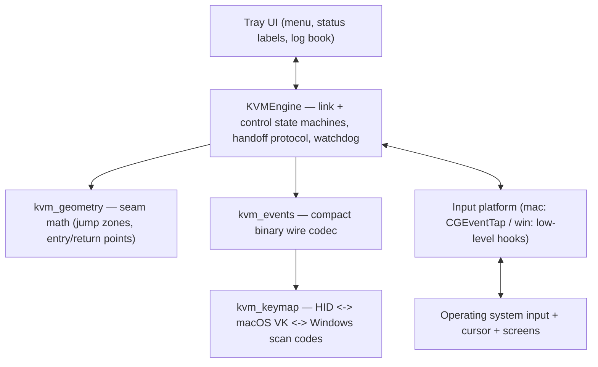

# 10. KVM Deep Dive — The Mouse & Keyboard Sharing Engine

This chapter explains the most complex subsystem in SecureShare: how one
machine's keyboard and mouse can drive a paired machine across the LAN.
Read [05-user-workflows.md](05-user-workflows.md) §4 first if you have not
seen the user-facing flow.

The engine (`core/kvm.py`, ~2000 lines) is composed of five layers:



## 10.1 The two state machines (per peer)

The engine deliberately separates **link status** (is the encrypted
channel alive and have we exchanged screen info?) from **control state**
(who drives whom right now?). A device that is merely online is *never*
shown as connected.

### Link status

```
offline -> connecting -> linked -> ready -> error
```

| State | Meaning |
|---|---|
| `offline` | No channel, or channel lost |
| `connecting` | An outbound open is in flight |
| `linked` | Authenticated channel established |
| `ready` | Channel is linked **and** screen layouts exchanged + topology verified |
| `error` | Last connect attempt failed (retried every 5 s) |

*Confirmed from code: `core/kvm.py:189-194` (constants), `core/kvm.py:793-802` (accessors).*

Only `ready` peers can be handed control. mDNS discovery alone never
makes a peer `ready`.

### Control state (per peer)

```
local -> requesting -> controlling
                ↘  (target side) remote_preparing -> remote
any state -> reverting -> local
```

| State | Meaning |
|---|---|
| `local` | Normal: this machine's input is fully its own |
| `requesting` | (controller) We asked to take over; waiting for the peer's decision |
| `controlling` | (controller) We are driving the peer. *Caveat:* the label lies slightly — before the peer confirms `active`, the cursor is parked and input is **not** yet suppressed; the UI shows "waiting for peer" via `control_label` |
| `remote_preparing` | (target) We accepted a request; waiting for the controller's `begin` |
| `remote` | (target) The peer drives our input; local input is suppressed |
| `reverting` | Transitional; forced back to `local` |

*Confirmed from code: `core/kvm.py:181-187` (constants),
`core/kvm.py:659-668` (control_label), `core/kvm.py:1629-1677`
(transitions).*

## 10.2 The acknowledged handoff protocol

The takeover is a four-message dance over the encrypted channel. Every
message carries a `handoff_id` so stale or duplicated control messages
can be ignored; a random starting sequence makes simultaneous takeovers
never share ids.

```mermaid
sequenceDiagram
    participant C as Controller
    participant T as Target

    C->>C: cursor enters 3 px jump zone at seam; compute entry point
    C->>T: CONTROL_REQUEST(id, entry_x, entry_y, modifier_mask)
    T->>T: validate: paired, consent, topology, no other controller, platform
    alt rejected
        T->>C: CONTROL_CANCEL(id, reason)
        Note over C,T: controller edge latched until pointer leaves it; refusal announced once
    else accepted
        T->>C: CONTROL_READY(id)
        C->>C: park + hide cursor at screen center (input STILL local)
        C->>T: CONTROL_BEGIN(id)
        T->>T: suppress local input; warp cursor to entry point; apply modifiers
        T->>C: CONTROL_ACTIVE(id)
        Note over C,T: ACTIVE — both sides suppress + forward
        C->>C: suppress local input; forward events
    end

    Note over C,T: hand-back paths
    C->>C: cursor crosses far edge of target screen
    C->>T: CONTROL_REVERT(id, "peer-edge")
    Note over T: ...or escape chord (Ctrl+Alt+Space) on either machine
    Note over T: ...or physical input on the target (mouse/key/scroll)
    Note over T: ...or channel loss / stall timeout / lease expiry (6 s)
    T->>C: CONTROL_REVERT / CONTROL_CANCEL
    Note over C,T: both restore local delegation, release held keys (ALL_KEYS_UP),<br/>cursor warped back just inside the seam
```

**Target-side lease.** The controlled machine grants control for
`LEASE_SECONDS` (6 s) and every inbound frame from the controller
(keep-alives flow every 2 s) refreshes it. When renewals stop — lost
channel, crashed controller, stalled link — the target returns to local
control **on its own** (`_expire_lease`); it never waits for a final
release message that may have been lost in transit.

### Why the dance exists (safety, in plain English)

- The target must **never** suppress its input for a peer that has not
  committed to driving (that would let anyone freeze your machine).
  Suppression happens only on `begin`.
- The controller must **never** suppress its own input until the target
  has confirmed it is actually ready to receive (`active`). A silent
  peer can therefore never lock the controller's keyboard either.
- The `handoff_id` prevents an old, timed-out request from acting on a
  new session.
- The **lease** means the target never depends on receiving a release:
  renewals stop → local control returns within 6 s even if every message
  is lost.
- Any timeout, refusal, platform failure, layout mismatch, or disconnect
  forces both sides back to `local` — control is never stuck "out".

*Confirmed from code: `core/kvm.py:1349-1487` (controller side),
`core/kvm.py:1491-1553` (target side), `core/kvm.py:1565-1627`
(cancel/revert/failure), `core/kvm.py:1093-1104` (timeouts).*

## 10.3 The target-side decision matrix

When a `CONTROL_REQUEST` arrives, the target runs these checks in order
(*confirmed from code: `core/kvm.py:1491-1553`*):

| # | Check | Refused with | Notes |
|---|---|---|---|
| 1 | Same handoff id already in flight? | ignore (duplicate) | |
| 2 | Pointer still dwelling on a previously rejected edge? | ignore (denial latch) | Stays silent until the controller cancels/leaves the edge |
| 3 | Peer paired **and** `kvm_allowed`? | `denied` + error toast | Consent is per-peer, off by default |
| 4 | Topology verified (both sides' seam sides agree)? | `topology` | Mismatch toasts on both sides |
| 5 | This machine already not-local? | `busy` | One active control at a time. Simultaneous requests: higher fingerprint wins; the loser withdraws its own request (`withdrawn`, not a refusal) |
| 6 | Input platform available? | `unavailable` | e.g. no platform on this OS |
| 7 | Channel still open? | reject | |
| 8 | *Any* peer currently non-local? | `busy` | Even a different peer's active control blocks a second one |

Only passing all checks moves the peer to `remote_preparing` and answers
`CONTROL_READY`.

## 10.4 Seam geometry (the math)

*All confirmed from code: `core/kvm_geometry.py`.*

**The model.** Each device has a `ScreenLayout` — the union bounds of all
its monitors (logical points; scale factors convert to physical pixels).
The user declares where the peer sits relative to this machine: one of
four sides. The seam is that edge of my screen and the *opposite* edge of
the peer's screen.

**Multi-monitor awareness.** Seam detection runs against the union bounds
(the true outer edges — moving between my *own* monitors never looks like
a seam) plus a monitor-membership guard: a point inside the union but in
empty space is not a seam. Uneven monitor heights leave such strips at
the OS-visible union edges (the cursor can park in them, and a v1
union-only check would fire a phantom takeover there). Seam fractions map
against the monitor the cursor is actually in, so side-by-side or stacked
monitors of different sizes each align proportionally along the seam
segment they contribute; out-of-monitor coordinates fall back to union
bounds for the peer mapping. `monitor_at(x, y)` answers membership;
`clamp_to_edge` applies the same guard.

**Key constants:**

| Constant | Value | Meaning |
|---|---|---|
| `JUMP_ZONE` | 3 px | Distance from an edge that counts as "reaching for the neighbor" |
| `LATCH_ZONE` | 8 px | Wider zone used only to decide when an edge latch may clear (must exceed the return-point inset) |
| `ENTRY_INSET` | 48 px | How far into the peer's screen the cursor lands, so residual crossing motion can't immediately claw it back to the edge |
| `REVERT_GRACE` | 2 s | How long a *revert* keeps the edge latched (time-bounded); refusals latch spatially until the pointer leaves the edge |

**The operations:**

1. **Jump-zone detection** — is the cursor within `JUMP_ZONE` of a real
   outer edge? Corners prefer the horizontal side (Input Leap behavior);
   points in empty union space are never seams. (`in_jump_zone`)
2. **Seam fraction** — the cursor's position along my seam edge,
   normalized to 0..1 against the containing monitor (`seam_fraction`).
   This is what makes unequal screen sizes line up: 30% down my 1440 px
   screen maps to 30% down the peer's 1080 px screen.
3. **Entry point** — the corresponding point just inside the peer's
   screen: the peer's opposite edge at the same fraction, then inset by
   `ENTRY_INSET` so the first move can't accidentally trigger the
   return-edge detector (`entry_point`).
4. **Return point** — where my cursor lands after a hand-back: just
   inside *my* seam edge (`JUMP_ZONE + 1` px), so re-taking control
   requires a deliberate move to the edge (`return_point`).
5. **Topology check** — my side and the peer's side must be opposites
   (`verify_topology`). If both users picked "peer on my right", that's
   a mismatch, and the seam stays inert.

**Example.** My screen is 2560×1440, the peer's is 1920×1080, and the
peer sits on my right. I move the cursor to (2555, 500) — 3 px from my
right edge, fraction ≈ 0.35. The entry point on the peer is its *left*
edge at 0.35 of its height, inset 48 px: about (48, 378). The peer's
cursor appears there, and control is handed off.

## 10.5 The wire format (binary events)

While the pairing/transfer/sync protocols use JSON frames, KVM events use
a compact binary format because mouse events arrive hundreds of times per
second:

```
[4-byte BE length][AES-GCM ciphertext]
    plaintext: [4-byte BE handoff_id][4-byte BE sequence][1-byte kind][body]
```

The `handoff_id` binds every frame to the handoff that created it and the
per-direction `sequence` gives the receiver monotonic ordering: frames
whose sequence is not strictly newer than the last seen are dropped
(replay protection, counted in the `replayed_frames` stat). The plaintext
header is `core/kvm_events.py:26` (`FRAME_HEADER`); protocol version 2.

Kinds (from `core/kvm_events.py:28-47`):

| Kind | Body | Meaning |
|---|---|---|
| `mouse_move_rel` | `>hh` (dx, dy) | Relative pointer motion |
| `mouse_move_abs` | `>ii` (x, y) | Absolute position |
| `mouse_button` | `>BB` (button, down) | Button state |
| `mouse_wheel` | `>ii` (dy, dx) | Wheel deltas |
| `key_down` / `key_up` | `>H` (HID code) | Key state (canonical HID key space) |
| `modifiers` | `>H` (mask) | Full modifier mask reconciliation |
| `screen_info` | JSON | My monitor layout + primary + my side for that peer |
| `control_request` | `>IiiH` (id, x, y, mask) | Request takeover |
| `control_ready` / `control_begin` / `control_active` | `>I` (id) | Handoff dance |
| `control_cancel` / `control_revert` | `>I` (id) + reason string | Abort / hand back (bound to the handoff id) |
| `all_keys_up` | `>I` (id) | Reconcile key state (no keys held), bound to the handoff |
| `ping` / `pong` | — | Keep-alive while control is active |
| `error` | `>B` code + message | Protocol error |
| `edge_hit` | `>Bii` (direction, x, y) | *Legacy informational hint* (warp toward seam); superseded by the acknowledged handoff |
| `take_control` | — | **Deprecated legacy event**, never emitted by the current engine |

*Confirmed from code: `core/kvm_events.py` (whole file), the legacy
flags at lines 30 and 62.*

### Key space: why HID

Both platforms convert their native key codes to the **USB HID keyboard
usage code** on the wire, so a Windows machine can drive a Mac and vice
versa (`core/kvm_keymap.py`):

- macOS capture: virtual keycode → HID (`mac_vk_to_hid`); injection is
  the inverse table.
- Windows capture: PS/2 scan code (+ extended prefix flag) → HID
  (`win_scan_to_hid`); injection uses scan codes deliberately — this
  preserves the user's keyboard layout (scan-code injection is
  layout-independent).
- Scope: the standard 104-key US set + modifiers. Media keys, IME, dead
  keys, Pause, F13–F24 are in `EXCLUDED_HID` and dropped at capture.
- Modifiers (Shift/Ctrl/Alt/Meta/AltGr) are tracked as a bit mask and
  sent as a full reconciliation (`modifiers` frame), rather than as
  press/release pairs, so both sides always agree on the exact modifier
  state.

*Confirmed from code: `core/kvm_keymap.py:1-54` (scope + masks),
`core/kvm_keymap.py:76-168` (tables).*

## 10.6 The platform layers (capture and injection)

Both platforms implement the same `InputPlatform` interface
(*confirmed from code: `core/kvm.py`*) — the engine never touches
OS APIs directly. The interface's contract:

> Capture runs whenever the engine is started. The platform is the
> dispatcher: every captured event first reaches the engine's watch-only
> `observe_local_*` entry points (seam detection, chord arming, request
> withdrawal, releasing control on physical input while remote), and when
> the platform is in `controlling` mode — `set_delegation(state)` —
> the same event is also suppressed locally and forwarded via
> `send_controlled_*` to the peer. `observe_local_button`/`wheel` are
> documented no-ops: a button press while remote releases control through
> the mouse-motion path, not a button-specific branch.

```mermaid
flowchart LR
    subgraph Mac["macOS (MacInputPlatform)"]
        M1["CGEventTap (HID-level) on a CFRunLoop thread<br/>callback only reads cheap fields + CGEventRetain,<br/>enqueues (mode, etype, event) into a bounded deque"]
        M2["Tap worker thread translates + calls the engine;<br/>overflow evicts only stale motion records,<br/>never key/button transitions"]
        M3["Suppress: swallow events + CGAssociateMouseAndMouseCursorPosition(False)"]
        M4["Inject: CGEventPost below the capture tap,<br/>SENTINEL user-data for self-echo filtering;<br/>software-cursor relative moves posted as<br/>sentinel-tagged MouseMoved (no warp)")
        M5["Permissions: Accessibility + Input Monitoring<br/>(CGPreflight/CGRequest*)"]
        M6["Health: keyboard_health() detects<br/>Secure Input stalls -> note_keyboard_stall()<br/>clears the queue and restarts the tap"]
    end
    subgraph Win["Windows (WindowsInputPlatform)"]
        W1["WH_MOUSE_LL + WH_KEYBOARD_LL hooks<br/>on a message-pump thread"]
        W2["Suppress: return 1 from the hook proc<br/>(no OS-level decoupling API)"]
        W3["Inject: SendInput with dwExtraInfo SENTINEL;<br/>warp-ignore queue for SetCursorPos echoes"]
        W4["Permissions: none required (no elevation)"]
        W5["Keys: scan-code injection (layout-independent)"]
    end
    ENG["KVMEngine"]
    ENG <--> Mac
    ENG <--> Win
```

### Shared design points

- **Self-injection filter:** every injected event is tagged with
  `SENTINEL = 0x5E4C0DE5` (macOS: `kCGEventSourceUserData` + own pid;
  Windows: `dwExtraInfo`). Capture callbacks drop those events so
  injected input never loops back into the engine. On Windows the
  self-tag is passed through (injected input must still reach apps).
- **Return-seam detection happens at injection time:** when the remote
  side injects an absolute move, it immediately checks whether the
  landing point is inside a jump zone and, if so, fires
  `on_remote_edge` — no polling. This is what makes "cursor reaches the
  far edge → control comes back" work smoothly.
- **macOS tap pipeline:** the tap callback runs on the CFRunLoop thread
  and must stay cheap (the OS kills a tap that takes too long), so it
  only reads the cheap fields (event type, hid, absolute location),
  retains the event, and pushes `(mode, etype, event)` onto a bounded
  deque (`_TAP_QUEUE_MAX = 512`). A dedicated worker thread pops records,
  translates them, and calls the engine. Overflow drops or evicts only
  motion records — a stale delta is useless, but a key or button
  transition is never lost. `note_keyboard_stall()` clears the queue when
  the Secure Input ladder restarts the tap.
- **macOS cursor decoupling (`CGAssociateMouseAndMouseCursorPosition`):**
  swallowing the event in the tap only stops *apps* from seeing input;
  the WindowServer still moves the cursor sprite off raw HID deltas.
  Decoupling (associate=False) is what actually stops the local cursor
  while remote/controlling; it is re-associated on `local` and always on
  `stop()`. Ordering is critical: the mode only flips *after* the Quartz
  call succeeds, so a failed call cannot leave the cursor stuck. When
  entering `controlling`, the cursor is hidden (refcount-guarded) and
  parked at the seam; a failure after the hide re-shows it.
- **macOS software cursor:** while controlling, relative motion is
  injected as sentinel-tagged absolute `MouseMoved` events tracking an
  internal `_soft_x/_soft_y` (reset on remote entry, clamped to the
  layout) — no per-event `CGWarpMouseCursorPosition` warping, so the
  remote cursor moves smoothly instead of teleporting.
- **macOS tap disable recovery:** if the tap times out or the user turns
  it off mid-session (`_on_tap_disabled`), the platform releases every
  pressed/injected key and button, re-associates the cursor, restores
  `local` mode, calls `engine.on_platform_input_lost()` (which sends a
  tagged revert to the controller and restores delegation both sides),
  then re-enables the tap.
- **macOS Secure Input health:** `keyboard_health()` distinguishes
  "stalled" (keys flowed then stopped while mouse flows — the classic
  Secure Input signature) from "no_keys" (no keys ever — ambiguous, user
  may simply not be typing). The engine escalates: restart the tap once,
  then latch a mouse-only notice for the clear stall case; for the
  ambiguous case it waits out a grace period and restarts the tap once,
  never latching. *Confirmed from code: `core/kvm.py`.*
- **Windows warp bookkeeping:** `SetCursorPos` generates a
  `WM_MOUSEMOVE` that would otherwise be forwarded as local input; an
  expected-position deque (max 64 entries, 0.25 s expiry) matches and
  consumes those echoes.

### What the engine does with captured events

The platform calls the watch-only `observe_local_*` entry points for
every captured event and, additionally, the matching `send_controlled_*`
while it is in `controlling` mode (suppress + forward):

| Callback | Engine reaction |
|---|---|
| `observe_local_mouse(dx, dy, x, y)` | While `local`: detect seam edge; while `requesting`: withdraw if the pointer left the edge; while `remote`: physical input → release control. While `controlling` it returns early — the forwarded path is `send_controlled_mouse` |
| `observe_local_button` / `observe_local_wheel` | Documented no-ops (watch-only) |
| `observe_local_key(hid, down)` | Track modifier mask + pressed set; arm/trigger the escape chord |
| `send_controlled_mouse(dx, dy)` | `controlling` + active stage + live channel only: coalesced relative motion to the peer |
| `send_controlled_key(hid, down)` | Same gates; modifiers forwarded as a `modifiers` mask frame, others as key frames |
| `send_controlled_button` / `send_controlled_wheel` | Same gates: button state / wheel deltas |
| `on_remote_edge(side, x, y)` | Far-edge hit → revert |
| `on_escape_chord()` | Forced release on either machine |
| `on_platform_input_lost()` | Active channel → tagged revert to the controller; delegation restored on both sides |
| `on_display_change()` | Re-send my screen layout to all channels |

*Confirmed from code: `core/kvm.py:1216-1470` (observe/send),
`core/kvm.py:1829-1870` (platform input lost).*

## 10.7 The per-channel writer (performance and liveness)

Every channel has a dedicated writer thread with **two queues**:
a control queue (high priority) and a data queue. Rationale:

- A mouse flood must never starve a revert/key frame — control, keep-alive,
  key, and button frames outrank mouse motion.
- Consecutive relative mouse deltas are **coalesced** into one frame,
  and deltas that overflow the signed 16-bit wire format are split into
  multiple frames (a blocked network writer can otherwise accumulate an
  arbitrarily large delta, and `struct.pack` would raise and kill the
  writer, freezing the session).
- Send failures tear the channel down (never silently), so the peer's
  per-peer state can never stay frozen at "controlling".

*Confirmed from code: `core/kvm.py:308-465`.*

## 10.8 The watchdog

A 200 ms loop (`kvm-watchdog` thread) enforces:

- **Handoff deadlines** (1.5 s each stage): an expired handoff sends
  `CONTROL_CANCEL` and reverts both sides.
- **Lease expiry:** a target whose `lease_deadline` passed (no inbound
  frames for `LEASE_SECONDS`, 6 s) returns to local control via
  `_expire_lease`.
- **Stalled openings:** unauthenticated opening connections are swept
  after 5 s — they never displace an active channel.
- **Keyboard health** (macOS): the Secure Input escalation ladder.
- **Stall detection while active:** if the channel sees no inbound
  frames for `STALL_TIMEOUT` (6 s) while control is active, it breaks
  the read loop and reverts control (keep-alives flow every 2 s).

*Confirmed from code: `core/kvm.py:1009-1104`, `core/kvm.py:477-499`.*

## 10.9 Edge latches (the anti-bounce logic)

After control returns to local, the seam edge must not immediately
re-trigger a takeover from residual mouse motion:

- **Revert latch:** after a *revert* (hand-back), the edge stays blocked
  for `REVERT_GRACE` (2 s), then expires — a deliberate move to the edge
  can take control again.
- **Refusal latch:** after a *refusal*, the edge stays blocked until the
  pointer clearly leaves the edge (`LATCH_ZONE`, 8 px) — so the refusal
  toast appears at most once per edge dwell.
- While a handoff is pending, the pointer wandering away from the edge
  withdraws the request (`edge-left` cancel), and the target's denial
  latch is released.

*Confirmed from code: `core/kvm.py:132-133` (constants),
`core/kvm.py:1108-1152` (latch maintenance), `core/kvm.py:1565-1611`
(revert/cancel handling).*

## 10.10 Diagnostic aids (F-key features)

The engine keeps bounded logs (never toasted per event) for debugging:

- A 64-entry **transition log** (timestamp, peer, state, stage, hid,
  reason, blocked-edge-after) — the blocked-edge column is what tells a
  handback from an accidental immediate re-acquire apart.
- A 16-entry **request log** and **revert log** with decisions and
  phases (`accepted → completed`).
- `diagnostics()` bundles counters (outbound/queued frames, reverts,
  send failures), queue depth, per-peer state, handoffs, latches, and
  platform diagnostics. The tray's **KVM log book** dumps this on demand.

*Confirmed from code: `core/kvm.py:616-700`, `tray/logbook.py`.*