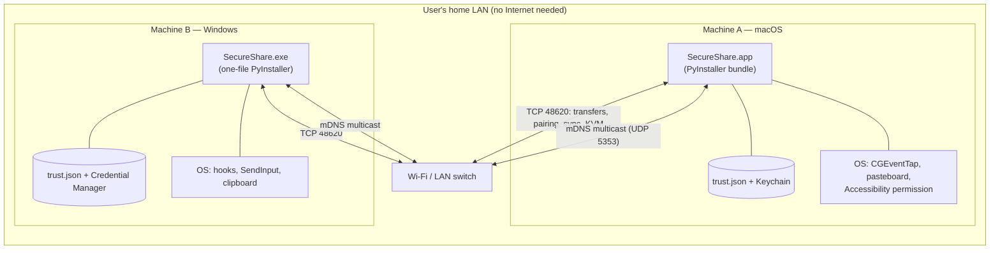

# 13. Deployment, Packaging, and Build

## How the app is run

### From source (development)

```bash
python -m venv .venv
source .venv/bin/activate        # Windows: .venv\Scripts\activate
pip install -r requirements.txt
python tray/app.py --name "My Mac"
```

Python 3.10+ required (3.12 recommended); older interpreters are refused
at import with a clear message (`core/__init__.py:14-23`). There is no
web server, no environment, no deploy target — running the process *is*
deployment.

### As a packaged app

- **macOS:** `pyinstaller --clean --noconfirm secure-share-mac.spec` →
  `dist/SecureShare.app`. Then optionally
  `./scripts/embed_share_extension.sh` to embed the Share Extension.
- **Windows:** `pyinstaller --clean --noconfirm secure-share-win.spec` →
  `dist\SecureShare.exe`. Then
  `powershell -ExecutionPolicy Bypass -File scripts\install_windows_share.ps1`
  to register the "Send with SecureShare" right-click verb.
- The app is unsigned; first launch on macOS may require
  right-click → Open (Gatekeeper).

## Deployment architecture



### How a request travels through the deployed system

1. User right-clicks a file on machine B → Windows launches
   `SecureShare.exe "<path>"` (registry verb).
2. The new process checks loopback port 48625 — machine A's instance
   (if running) is primary. If primary exists, files are forwarded over
   loopback and the new process exits.
3. The primary shows its picker; user picks machine A.
4. The sender resolves A's address from the mDNS registry and opens TCP
   to A's listener port (48620 or the discovered port).
5. A's listener runs admission checks (subnets, connection cap, rate
   limit), looks up the sender's trust key, and streams the file through
   the encrypted chunk protocol into `Downloads/SecureShare`.

## What the PyInstaller specs bundle

*Confirmed from code: `secure-share-mac.spec`, `secure-share-win.spec`.*

| | macOS | Windows |
|---|---|---|
| Output | `dist/SecureShare.app` | `dist\SecureShare.exe` (one file) |
| Entry | `tray/app.py` | `tray/app.py` |
| Hidden imports | keyring backends (macOS), `pystray._darwin`, tkinter + filedialog + messagebox | keyring backends (Windows), `pystray._win32`, tkinter trio |
| Data | `tray/icons/tray.png`, icon, embedded Share Extension via script | icon |
| Info.plist extras | `LSUIElement` (menu-bar only), URL scheme `secureshare://`, `NSServices` ("Send to SecureShare"), `LSMinimumSystemVersion 11.0` | — |
| Build tag | writes `core/_build_tag.py` with the git short hash (fallback `dev`) | same |

The version shown in the tray menu is `APP_VERSION (BUILD_TAG)` — e.g.
`0.9.3 (abc1234)` — so two devices can be verified to run the same build
(`core/version.py`).

## OS integration points

| Integration | Mechanism | Installed by |
|---|---|---|
| macOS right-click → Send to SecureShare | NSServices entry (`sendFile`, `public.data`) in the app's Info.plist | The spec itself; no signing required |
| macOS Share menu (macOS 26+ / signed builds) | Native Swift Share Extension (`com.apple.share-services`) at `Contents/PlugIns/SecureShareShare.appex` | `scripts/embed_share_extension.sh` (builds with `swiftc`, ad-hoc or Developer ID signing, registers with `pluginkit`) |
| Windows right-click → Send with SecureShare | Per-user registry verb under `HKCU:\Software\Classes\*\shell\SecureShare`, command `"<exe>" "%1"` | `scripts/install_windows_share.ps1` (no admin needed); removed by `uninstall_windows_share.ps1` |
| macOS URL scheme | `secureshare://send?files=...` handled by `parse_share_argv` | Info.plist `CFBundleURLTypes` |

*Confirmed from code: `scripts/`, `native/share_extension/`, both specs.*

## CI

A single GitHub Actions workflow (`.github/workflows/ci.yml`) runs on
push to `main` and PRs: a matrix of `macos-latest` and `windows-latest`
× Python 3.10 and 3.12, installing `requirements.txt` and running
`pytest tests -m "unit or socket" -q` with `SECURESHARE_CI=1`. No Linux
job (the app targets macOS/Windows), no packaging step.

## Testing as part of deployment confidence

The test suite is grouped by marker (`pyproject.toml:40-47`):

| Marker | What it covers | Runs in CI |
|---|---|---|
| `unit` | Pure logic: crypto, keymaps, geometry, event codecs, trust store, tray menu construction | Yes (default) |
| `socket` | Loopback integration with two real Nodes: transfers, pairing (incl. MITM), sync + auth/replay, KVM engine with a fake input platform, limits, share IPC | Yes (`unit or socket`) |
| `manual` | Real mDNS, real clipboard, physical KVM on two devices | No — run by hand per `RELEASE.md` |

Notable fixtures (`tests/conftest.py`): `node_pair` runs two real Nodes
on loopback ports 49500/49501 with isolated data dirs and
`keyring_enabled=False`; `NodePair.pair()` performs the full happy-path
pairing; socket tests auto-skip when sockets are unavailable. The KVM
tests (`tests/test_kvm.py`, 1533 lines) exercise the engine with an
in-memory `FakePlatform`, covering handoffs, hand-backs, latches,
timeouts, security (spoofed opens), and dozens of stuck-state
regressions.

## Deployment verification checklist (from `RELEASE.md`)

Automated gates (CI), then per-platform two-device LAN checks:
discovery, pairing persistence across restart, transfer (including
filename collision), clipboard sync, OS share entries, idle CPU posture;
then physical KVM checks: permissions, handoff, escape chord, hand-back,
key release, consent refusal, mid-control link kill, stuck-state and
injection-failure regressions; then network posture (LAN-only listener,
firewall rules), packaging steps, and frozen-app smoke tests.