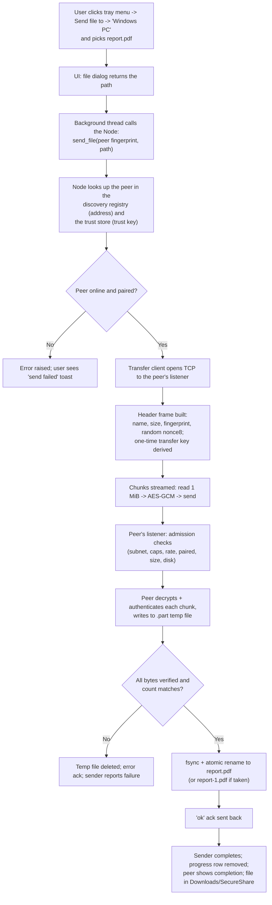

# 15. End-to-End Example — Sending a File

This chapter traces one complete action — **"send `report.pdf` from this
Mac to a paired Windows PC"** — through every layer, with the code that
implements each step.

## The complete journey

## Step by step

### Step 1 — The user action becomes a menu click

The tray menu's **Send file to** submenu is built from the current
discovery registry, filtered to *paired* peers. Clicking a peer posts
`_pick_and_send` to the main-thread queue, which opens tkinter's native
file dialog.

*Confirmed from code: `TrayApp._send_submenu` — `tray/app.py:1090-1102`;
`TrayApp._pick_and_send` — `tray/app.py:1151-1161`.*

### Step 2 — The send runs on a background thread

The file dialog path goes to `_send_to`, which:
1. Registers a progress row in the UI (`send:<fp>:<name>` key).
2. Starts a `send-file` thread that calls `node.send_file(...)`.
3. Posts progress events (throttled to one per 200 ms) back to the UI
   queue, and posts completion/failure when done.

*Confirmed from code: `TrayApp._send_to` — `tray/app.py:1163-1191`;
`TrayApp._post_progress` — `tray/app.py:635-643`.*

### Step 3 — The Node resolves the target

`Node.send_file` looks up the peer by fingerprint in the discovery
registry (its current host/port — mDNS keeps this fresh across network
changes) and in the trust store (its trust key). Missing registry entry
→ "device not on network"; unpaired → "pair first".

*Confirmed from code: `core/node.py:115-130`.*

### Step 4 — The sender builds the protocol

The transfer client:
- Reads the file size and basename.
- Generates 8 random bytes (`nonce8`) and derives a **one-time transfer
  key** from the stored trust key.
- Sends the JSON header (`type=transfer`, name, size, fingerprint,
  nonce8, chunk_size) — and keeps the *exact header bytes*, because they
  become the authenticated data for every chunk.

*Confirmed from code: `core/transfer.py:121-139`; key derivation in
`core/crypto.py:41-43`.*

### Step 5 — The receiver admits the connection

On the peer, the accepted connection passes the gate: trusted-subnet
check → per-IP connection cap → token-bucket rate limit → read the first
frame. The frame type `transfer` selects the file-receive path.

*Confirmed from code: `core/transfer.py:262-320`.*

### Step 6 — The receiver validates the sender and the header

- The sender's fingerprint must exist in the peer's trust store (else
  `not_paired`).
- nonce8 must be exactly 8 bytes; chunk_size ≤ 4 MiB; size sane and
  ≤ the max (default 10 GiB); free disk space ≥ size + 1 MiB.
- The final filename is sanitized to a basename and made collision-safe
  with a `-1`, `-2`, … suffix, reserved against concurrent transfers.

*Confirmed from code: `core/transfer.py:327-372, 440-456`.*

### Step 7 — The chunk loop

Sender: read 1 MiB, nonce = `nonce8 + chunk_index`, AES-GCM-encrypt with
AAD = header bytes, send `[8-byte length][ciphertext]`.

Receiver: read the length, enforce bounds (0 < len ≤ chunk_size + 16),
read the ciphertext, decrypt with the *same* nonce construction and the
key derived from *its* stored trust key + the header's nonce8. Any
`InvalidTag` → "chunk authentication failed", temp file deleted, error
ack. The two sides agree on the key because pairing stored the *same*
trust key on both machines.

*Confirmed from code: `core/transfer.py:139-152` (send),
`core/transfer.py:390-417` (receive), `core/crypto.py:79-87` (nonce).*

### Step 8 — Finalization

- Receiver: `flush` + `fsync` the temp file, then `os.replace` to the
  final path — atomic, so a crash never leaves a partial file under the
  final name. Byte count must equal the declared size.
- Receiver sends `{"type":"ok","bytes":received}` and fires the
  completion callback (name, size, path, sender fingerprint).
- Sender: validates the ack, computes elapsed time + MB/s, returns the
  result dict.

*Confirmed from code: `core/transfer.py:412-436` (receiver finish),
`core/transfer.py:158-167` (sender finish).*

### Step 9 — The user sees the result

Completion flows through the Node's callbacks into the tray queue:
`_tx_done` removes the progress row; the transfer window closes when
nothing is in flight. On the receiving machine, `_tx_recv_done` fires the
same UI bookkeeping; the file is in `Downloads/SecureShare`.

*Confirmed from code: `tray/app.py:677-692`, `tray/app.py:683-684`.*

## The corresponding code, in order

| Step | File:line |
|---|---|
| Menu → pick file | `tray/app.py:1090-1161` |
| Background send + progress | `tray/app.py:1163-1191`, `tray/app.py:635-643` |
| Peer + key resolution | `core/node.py:115-130` |
| Send protocol | `core/transfer.py:105-167` |
| Listener gate + dispatch | `core/transfer.py:262-320` |
| Receive + validation | `core/transfer.py:321-372` |
| Chunk loop | `core/transfer.py:390-417` |
| Atomic finalize + ack | `core/transfer.py:418-436` |
| Nonce / key math | `core/crypto.py:41-43, 79-87` |
| Completion UI | `tray/app.py:677-692` |

## Failure modes you can actually hit (as coded)

| Situation | Result |
|---|---|
| Peer goes offline mid-transfer | `OSError` on send → `_pending_error` surfaces the receiver's error if any, else broken pipe → "send failed" toast; receiver's `finally` cleans up the temp file |
| Sender not paired | Receiver refuses before reading data: `not_paired` |
| File too big / no disk space | Receiver refuses with `too_large` / `no_space`; sender surfaces the message |
| Name already exists | Automatic `report-1.pdf`, `report-2.pdf`, … |
| Tampered bytes on the wire | AES-GCM `InvalidTag` → abort, temp file deleted, error ack |
| Two transfers with the same name at once | Path claim prevents the race: second gets `-1` |